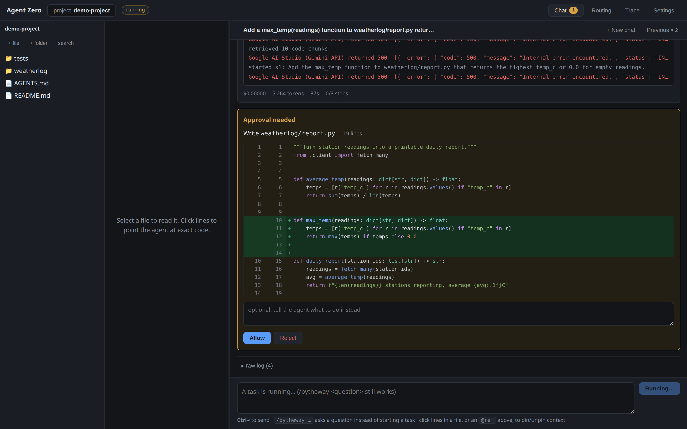
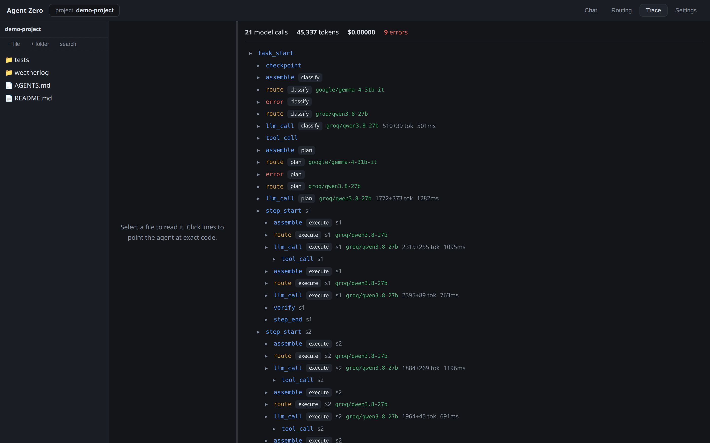
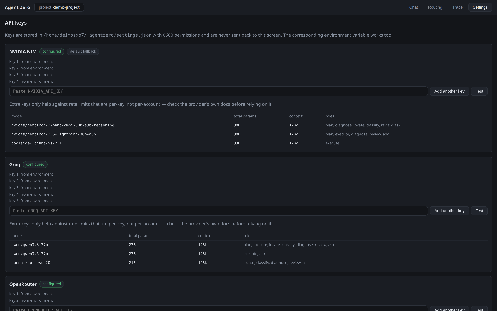
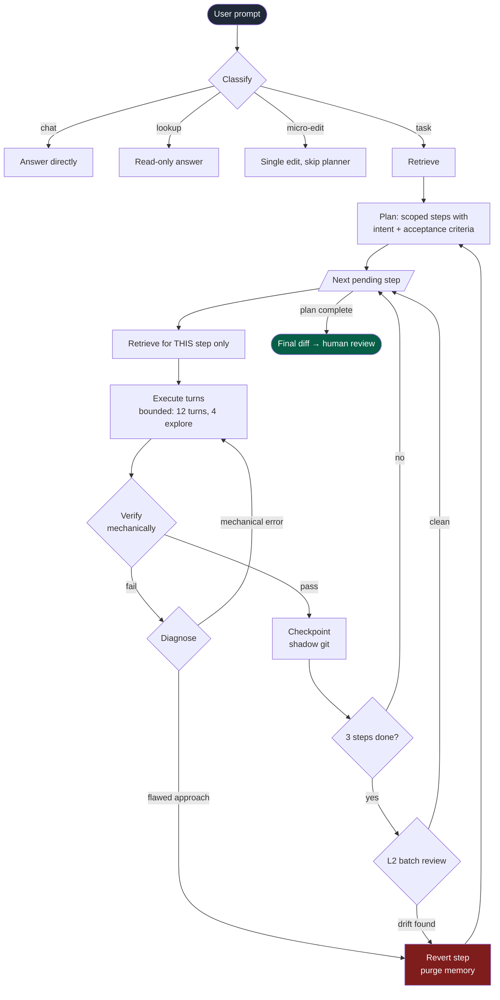
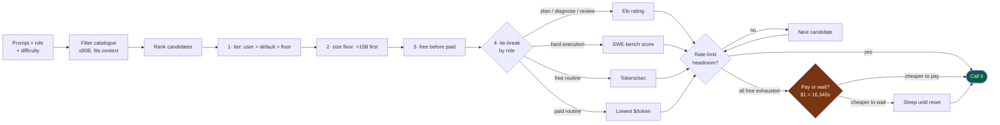

<h1 align="center">Agent Zero</h1>

<p align="center">
  <b>An agentic coding IDE built for small open-weight models.</b><br>
  Nothing over 80B parameters. Free-tier APIs or your own GPU. No subscriptions.
</p>

<p align="center">
  <a href="#quickstart">Quickstart</a> ·
  <a href="#how-it-works">How it works</a> ·
  <a href="docs/">Docs</a>
</p>

<p align="center">
  <b>Status:</b> working prototype. The orchestration loop, routing, retrieval,
  compaction, approval gates and the trace dashboard are implemented and covered
  by 296 offline tests.<br>Block-level accept/reject of a finished diff is not
  built — review happens per-action, as the agent proposes each change.
</p>

<p align="center">
  
  
  
</p>

<p align="center"></p>

<p align="center"><i>The agent proposes a write; nothing lands until you approve it. The red<br>
lines are two provider 500s the router absorbed by falling back — the task never stalled.</i></p>

---

## Why this exists

Most agentic coding tools assume a frontier model on the other end of the wire:
a huge context window, reliable multi-step planning, and a budget to match. Point
them at an 8B or 30B open-weight model and they fall apart — the model loses the
plan, forgets its own instructions, loops on a failing edit, and burns the free
tier doing it.

Agent Zero inverts that. **The control flow lives in code, not in a model.** A
deterministic loop drives many narrow, schema-checked model calls, each given
only the context it needs. Every piece of task state — the plan, each step, every
retrieved chunk, every routing decision — lives in SQLite, so nothing is lost
when a call times out, a provider rate-limits you, or the process dies.

The result is a system where a small model never has to hold the whole task in
its head, because it is never asked to.

## What it looks like

One window, four tabs. **Chat** is where you describe a change and watch the plan
execute; the file tree sits on the left, and clicking any line pins it into the
agent's context.

<p align="center"></p>

The agent split this request into three steps and reported each one as it landed
— with the files it touched as clickable `@path:line` references, a **Revert to
here** link on every step, and the running token and dollar cost. This whole task
cost **$0.00** and 45,337 tokens, because every model it picked was on a free tier.

**Routing** shows which model took each piece of work and why — never hidden,
updated live:

<p align="center"></p>

**Trace** is the call tree: every model call and tool call nested under the step
that caused it, with tokens, duration, and cost per node. Expand any node for its
exact input and output. It reads the same while a task is running and after it has
finished:

<p align="center"></p>

Note the `error → route` pairs: those are providers failing and the router moving
on without losing the step.

**Settings** is where provider keys go. Keys are written to
`~/.agentzero/settings.json` at mode `0600` and are never sent back to the browser
— the screen only ever shows that a key exists:

<p align="center"></p>

Each provider lists its models with total parameter counts, so the ≤80B ceiling is
visible rather than asserted.

## What you get

| | |
|---|---|
| **Deterministic orchestration** | A hardcoded `classify → retrieve → plan → execute → verify → review` loop. Models fill roles; the loop decides what happens next. It cannot recurse infinitely. |
| **Stuck detection** | 12 turns per step, a 4-turn explore budget before an edit is forced, and a loop-breaker that fires on 3 identical tool calls. Up to 2 replans per task, then a graceful abort with a partial diff. |
| **Smart routing** | Every prompt is ranked across 7 providers on role, difficulty, context size, live rate-limit headroom, and a cost-vs-time exchange rate. Fallback is automatic and never loses progress. |
| **Transparent by default** | Every routing decision carries a human-readable reason, streamed live to the UI. You always see which model is doing what, and why. |
| **Context compaction** | No rolling transcript. Context is rebuilt fresh from SQLite on every call, with relevance-scored eviction when it nears the window. Pinned blocks never drop. |
| **Structural code retrieval** | A LocAgent-style code graph (files → classes → functions, with `invokes` edges), not vector embeddings. Returns line ranges, never whole files. |
| **Resumable** | Close the IDE mid-task. `npm run cli -- resume` picks up at the next pending step. |
| **Approval gates** | Every side-effecting tool call — a write, a shell command, a server start — stops and waits for you. |
| **Full trace** | A real call tree: drill into any node for its exact input, output, model, tokens, cost, and duration. Identical live and after the fact. |

## Quickstart

**Requirements:** Python ≥ 3.12, Node ≥ 22.5, and `git` on your PATH. That's it —
the server's only dependencies are pydantic, httpx, FastAPI and uvicorn, and
SQLite ships with Python.

```bash
git clone https://github.com/devDivij/agentic-ide.git agentzero
cd agentzero

npm install     # installs the UI, creates server/.venv, installs the Python runtime
npm test        # 296 offline tests, no API key needed
npm run dev     # UI → http://localhost:5319   server → http://localhost:4319
```

Open the UI, click **Settings**, and paste at least one provider key. Every
provider below has a free tier:

| Provider | Where to get a key |
|---|---|
| NVIDIA NIM | [build.nvidia.com](https://build.nvidia.com) — free, no card |
| Groq | [console.groq.com](https://console.groq.com) — free tier |
| OpenRouter | [openrouter.ai](https://openrouter.ai) — free models + paid overflow |
| Mistral | [console.mistral.ai](https://console.mistral.ai) — free tier |
| Google AI Studio | [aistudio.google.com](https://aistudio.google.com) — free tier |
| Cohere | [dashboard.cohere.com](https://dashboard.cohere.com) — trial key |
| Ollama | local, no key — see [setup](docs/setup.md#local-models-ollama) |

Then pick a project folder from the header and describe a change.

📖 **Full setup** — Windows and macOS notes, multiple keys per provider, local
models, environment variables: **[docs/setup.md](docs/setup.md)**.

## How it works

A task moves through one fixed pipeline. The loop is written in
[`orchestrator.py`](server/agentzero/agent/orchestrator.py) and a model cannot
alter its shape:



Three properties do most of the work:

1. **Steps never inherit the whole project.** Retrieval runs per step, so a
   10-step task is 10 small prompts, not one that grows until it collapses.
2. **The loop does not trust the model's "done".** Verification is mechanical —
   files touched, exit code of the last command — before a step can close.
3. **Failure has a taxonomy, not a retry counter.** A red test suite means *fail
   forward* (keep the code, hand over the logs). A stuck loop means *backtrack* —
   roll the tree back, purge the bad step, and replan with the reason attached.

### Routing



The pay-vs-wait constant is not a guess. It falls out of the scoring weights in
[`router.py`](server/agentzero/agent/router.py): `(0.65/$0.15) / (0.35/1320s)`,
so a dollar of spend is worth about 16,345 seconds of wall clock. When every free
model is rate-limited, the router prices the cheapest paid overflow against the
wait and picks the smaller number.

## Documentation

| Doc | What's in it |
|---|---|
| [Setup](docs/setup.md) | From scratch on Linux, macOS, Windows. Keys, multiple keys, local models. |
| [Project structure](docs/project_structure.md) | What every file does. Start here to find your way around. |
| [Orchestration](docs/orchestrator.md) | The deterministic loop, failure taxonomy, backtracking, L2 review. |
| [Routing](docs/router.md) | Catalogue, ranking, rate buckets, the pay-vs-wait formula. |
| [Context handling](docs/context_handling.md) | Durable memory, eviction tiers, pins, `/bytheway`. |
| [Retrieval](docs/retrieval.md) | The code graph, traversal, ranking, lexical fallback. |
| [Supporting features](docs/supporting_features.md) | Approval gates, revert, `AGENTS.md`, tools. |

## Using it from the terminal

The runtime does not depend on the UI:

```bash
npm run cli -- providers                             # what's configured and reachable
npm run cli -- run "add retry logic" --project /path/to/repo
npm run cli -- run "fix the tests" --project . --yes # skip approval prompts
npm run cli -- resume --project /path/to/repo        # continue an interrupted task
npm run cli -- trace <taskId> --project /path/to/repo
```

## In the chat

- `@path`, `@path:12`, `@path:12-40` — pin a file or exact lines into context.
  Click lines in the file viewer to insert these. Pins survive compaction.
- `/bytheway <question>` — ask one isolated question with zero task context. The
  running task is untouched.
- `AGENTS.md` in the project root — per-project rules (style, test command,
  conventions), injected into every model call.

## Repository layout

```
server/agentzero/agent/   the agentic core — read types.py, then orchestrator.py
server/agentzero/web/     HTTP host: routes, SSE stream, revert, settings
server/agentzero/cli.py   headless driver
server/tests/             the offline suite (pytest)
shared/types.ts           the wire contract, mirrored by agent/types.py
ui/src/                   React front-end (chat, files, routing, trace, settings)
docs/                     architecture and design rationale
```

`shared/types.ts` stays TypeScript on purpose: the UI imports it type-only, so
the browser keeps compile-time checking of what the server sends, and
`agent/types.py` emits exactly those camelCase spellings. The server is Python
and has no build step; `npm run build` produces `ui/dist`, which the server
serves, so production is a single process.

## Reading the code

If you want to understand how it works rather than just run it, read in this
order: [`shared/types.ts`](shared/types.ts) — the wire contract, and the
vocabulary everything else uses (mirrored exactly by
[`agent/types.py`](server/agentzero/agent/types.py)); then
[`docs/project_structure.md`](docs/project_structure.md) for the map; then
[`agent/orchestrator.py`](server/agentzero/agent/orchestrator.py), the loop
everything else serves — its tuning constants are at the top of the file.

## License

[MIT](LICENSE).
