# Orchestration — Flow Reference

Companion to [`02-orchestration.md`](02-orchestration.md). That doc owns **definitions**: states, dataclasses, taxonomy rows, config knobs. This doc owns **flows**: every path the task can take, including the ones that fail.

Scope note: diagrams cover the settled architecture only — custom FSM, Electron shell, no LLM supervisor. Concierge (§3a) does not change this: it is four calls at fixed points (classify, answer, brief, debrief), not a loop that drives the FSM — same relationship to the graph as Planner or Diagnostician.

## Legend

| Shape / edge | Means |
|---|---|
| rectangle | deterministic code step, no model call |
| rounded | model call, schema-validated |
| diamond | branch on a mechanical predicate |
| double-line node | durable write — git commit, event append, fact write |
| dashed edge | asynchronous / out-of-band signal |
| `n/m` on an edge | counter guard — attempt n of cap m |

Three invariants hold in every diagram below:

1. **No model output is ever a transition.** A model returns JSON; code branches on it. Invalid JSON is failure class 1, not a state change.
2. **No edge retries an identical action.** Every recovery edge changes model, provider, context, or approach.
3. **Every terminating path reaches `FINALIZE`.** There is no exit that produces nothing — abort emits the best green checkpoint's diff.

---

## 1. The boundary: what code decides, what a model decides

The load-bearing claim of the design. Everything else is a consequence.

```mermaid
flowchart LR
  subgraph CODE["Code decides — deterministic, testable, replayable"]
    A1["state transitions"]
    A2["which model, which provider, which window"]
    A3["what text enters the window"]
    A4["whether a gate passed"]
    A5["retry / revert / replan / abort"]
    A6["what is committed"]
    A7["when the run stops"]
  end
  subgraph MODEL["Model decides — schema-validated slot fill only"]
    B1["Plan.steps and depends_on"]
    B2["edit content and tool arguments"]
    B3["Diagnosis for taxonomy rows 5 and 9"]
    B4["per-criterion checklist verdict"]
    B5["holistic review at L3"]
  end
  CODE -->|"assembled window"| MODEL
  MODEL -->|"JSON, validated against a frozen schema"| CODE
```

A weak model that drifts can produce a bad *slot value*. It cannot produce a bad *control decision*, because it is never asked for one.

---

## 2. System context

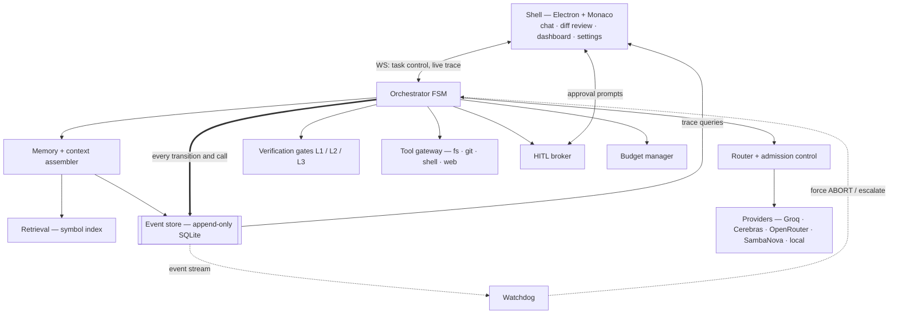
```mermaid
flowchart TB
  UI["Shell — Electron + Monaco<br/>chat · diff review · dashboard · settings"]
  ORCH["Orchestrator FSM"]
  ROUTER["Router + admission control"]
  MEM["Memory + context assembler"]
  RET["Retrieval — symbol index"]
  GATES["Verification gates L1 / L2 / L3"]
  TOOLS["Tool gateway — fs · git · shell · web"]
  HITL["HITL broker"]
  BUD["Budget manager"]
  EV[["Event store — append-only SQLite"]]
  PROV["Providers — Groq · Cerebras · OpenRouter · SambaNova · local"]

  UI <-->|"WS: task control, live trace"| ORCH
  ORCH --> ROUTER
  ORCH --> MEM
  ORCH --> GATES
  ORCH --> TOOLS
  ORCH --> HITL
  ORCH --> BUD
  ROUTER --> PROV
  MEM --> RET
  MEM --> EV
  ORCH ==>|"every transition and call"| EV
  EV -.->|"event stream"| WD["Watchdog"]
  WD -.->|"force ABORT / escalate"| ORCH
  EV -->|"trace queries"| UI
  HITL <-->|"approval prompts"| UI
```

The event store is the hub, not a log: tracing, resume, cost accounting, memory provenance and routing telemetry are all reads against it. One artifact, five consumers.

---

## 3. Master FSM

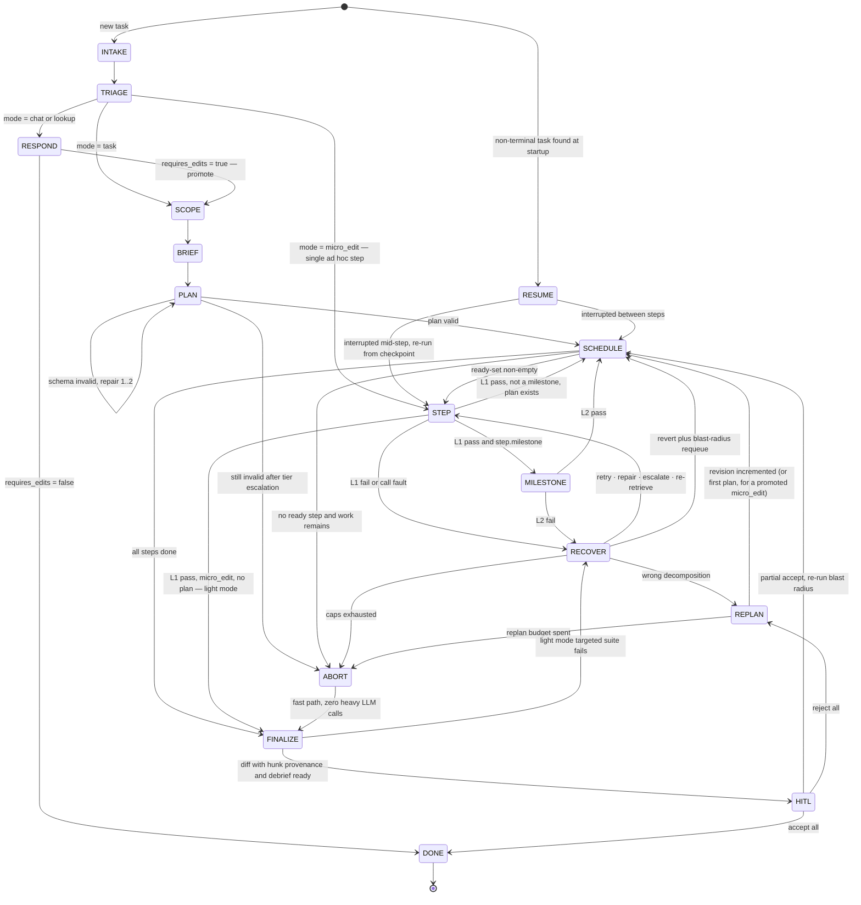
```mermaid
stateDiagram-v2
    [*] --> INTAKE : new task
    [*] --> RESUME : non-terminal task found at startup

    INTAKE --> TRIAGE
    TRIAGE --> RESPOND : mode = chat or lookup
    TRIAGE --> STEP : mode = micro_edit — single ad hoc step
    TRIAGE --> SCOPE : mode = task

    RESPOND --> DONE : requires_edits = false
    RESPOND --> SCOPE : requires_edits = true — promote

    SCOPE --> BRIEF
    BRIEF --> PLAN
    PLAN --> PLAN : schema invalid, repair 1..2
    PLAN --> SCHEDULE : plan valid
    PLAN --> ABORT : still invalid after tier escalation

    RESUME --> SCHEDULE : interrupted between steps
    RESUME --> STEP : interrupted mid-step, re-run from checkpoint

    SCHEDULE --> STEP : ready-set non-empty
    SCHEDULE --> FINALIZE : all steps done
    SCHEDULE --> ABORT : no ready step and work remains

    STEP --> SCHEDULE : L1 pass, not a milestone, plan exists
    STEP --> MILESTONE : L1 pass and step.milestone
    STEP --> FINALIZE : L1 pass, micro_edit, no plan — light mode
    STEP --> RECOVER : L1 fail or call fault

    MILESTONE --> SCHEDULE : L2 pass
    MILESTONE --> RECOVER : L2 fail

    RECOVER --> STEP : retry · repair · escalate · re-retrieve
    RECOVER --> SCHEDULE : revert plus blast-radius requeue
    RECOVER --> REPLAN : wrong decomposition
    RECOVER --> ABORT : caps exhausted

    REPLAN --> SCHEDULE : revision incremented (or first plan, for a promoted micro_edit)
    REPLAN --> ABORT : replan budget spent

    FINALIZE --> HITL : diff with hunk provenance and debrief ready
    FINALIZE --> RECOVER : light mode targeted suite fails
    HITL --> DONE : accept all
    HITL --> SCHEDULE : partial accept, re-run blast radius
    HITL --> REPLAN : reject all

    ABORT --> FINALIZE : fast path, zero heavy LLM calls
    DONE --> [*]
```

Guards, stated once:

| Edge | Guard |
|---|---|
| `TRIAGE → RESPOND` / `STEP` / `SCOPE` | `mode` from `Triage.mode` — code branches, TRIAGE never transitions itself |
| `RESPOND → SCOPE` | `Response.requires_edits = true` — one-way, `INTAKE` not re-entered |
| `PLAN → PLAN` | `repair_attempts < 2` and validator produced a locatable error |
| `PLAN → ABORT` | repairs spent **and** tier already escalated once |
| `SCHEDULE → STEP` | ready-set = steps whose `depends_on` are all `done` |
| `SCHEDULE → ABORT` | ready-set empty, unfinished steps remain ⇒ cycle or orphaned dep |
| `STEP → MILESTONE` | `step.milestone` **or** `steps_since_gate ≥ k` |
| `STEP → FINALIZE` (light) | step came from `TRIAGE` directly (`micro_edit`, no `Plan` object) and L1 passed |
| `FINALIZE → RECOVER` (light) | targeted suite fails — row 5, detected here instead of at `MILESTONE` because `micro_edit` has none |
| `RECOVER → REPLAN` | taxonomy row 8 or 9 (or row 5 on a repeat failure — see §3a for the `micro_edit` case), and `replans_used < 2`; for a `micro_edit` this is the first plan, not a revision |
| `ABORT → FINALIZE` | always — abort never terminates directly |

---

## 3a. TRIAGE and the front door

Definitions in [`02-orchestration.md` §3a](02-orchestration.md#3a-concierge--front-door-and-report-out). This section owns the branch.

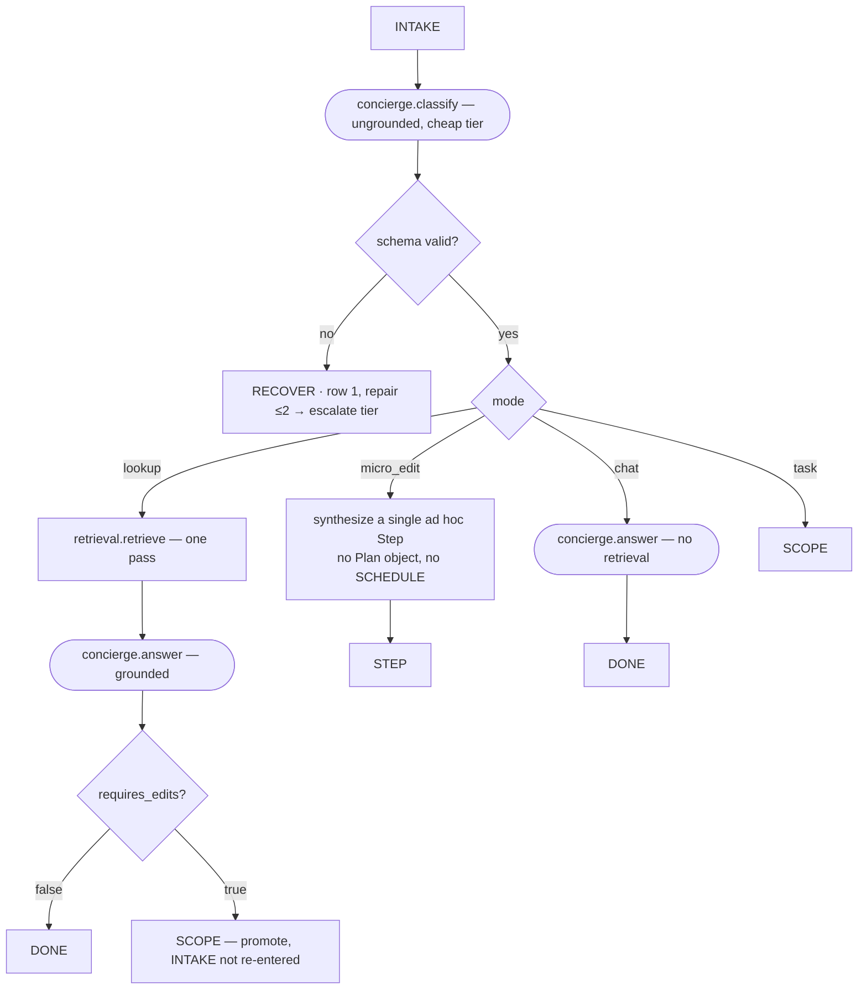
```mermaid
flowchart TD
  IN["INTAKE"] --> TR(["concierge.classify — ungrounded, cheap tier"])
  TR --> V{"schema valid?"}
  V -->|no| R1["RECOVER · row 1, repair ≤2 → escalate tier"]
  V -->|yes| M{"mode"}
  M -->|chat| RES(["concierge.answer — no retrieval"])
  M -->|lookup| RQ["retrieval.retrieve — one pass"] --> RES2(["concierge.answer — grounded"])
  M -->|micro_edit| ST["synthesize a single ad hoc Step<br/>no Plan object, no SCHEDULE"] --> STEP["STEP"]
  M -->|task| SC["SCOPE"]
  RES --> DONE1["DONE"]
  RES2 --> RE{"requires_edits?"}
  RE -->|false| DONE2["DONE"]
  RE -->|true| SC2["SCOPE — promote, INTAKE not re-entered"]
```

Two things this diagram makes explicit that the prose could gloss over:

- **`micro_edit` never gets a `Plan`.** The single step is built directly from `Triage`, not routed through `PLAN`. If it needs one later, it gets it the normal way — through `RECOVER → REPLAN`, same as any step that turns out harder than it looked. The trigger is row 5, not 8/9: `micro_edit` skips `MILESTONE`, so its targeted suite runs at `FINALIZE(light)` instead — but row 5 is defined by "a test runner reports a step-local failure," not by which state ran the runner. A repeat failure there hits the same revert-and-replan handler row 5 already has; `REPLAN` just has no prior revision to increment.
- **The promotion edges point forward, never back to `TRIAGE`.** A second classify call on the same task would be a model re-deciding a transition it already made — exactly what §1's invariant forbids. `RESPOND`'s `requires_edits` and `RECOVER`'s taxonomy rows are the only two gates that can escalate scope, and both already existed for other reasons before this section added a caller.

`BRIEF`, entered only from `SCOPE` on the `task` path, is a single node — no branch to draw:

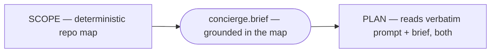
```mermaid
flowchart LR
  SC["SCOPE — deterministic repo map"] --> BR(["concierge.brief — grounded in the map"])
  BR --> PL["PLAN — reads verbatim prompt + brief, both"]
```

---

## 4. Lifecycle — happy path sequence

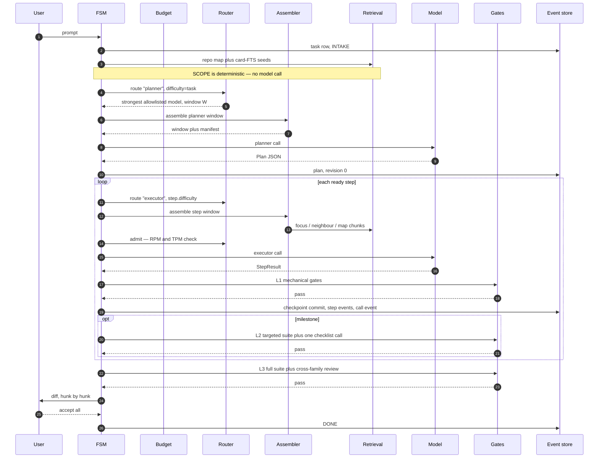
```mermaid
sequenceDiagram
    autonumber
    participant U as User
    participant F as FSM
    participant B as Budget
    participant R as Router
    participant A as Assembler
    participant X as Retrieval
    participant L as Model
    participant G as Gates
    participant E as Event store

    U->>F: prompt
    F->>E: task row, INTAKE
    F->>X: repo map plus card-FTS seeds
    Note over F,X: SCOPE is deterministic — no model call
    F->>R: route "planner", difficulty=task
    R-->>F: strongest allowlisted model, window W
    F->>A: assemble planner window
    A-->>F: window plus manifest
    F->>L: planner call
    L-->>F: Plan JSON
    F->>E: plan, revision 0

    loop each ready step
        F->>R: route "executor", step.difficulty
        F->>A: assemble step window
        A->>X: focus / neighbour / map chunks
        F->>R: admit — RPM and TPM check
        F->>L: executor call
        L-->>F: StepResult
        F->>G: L1 mechanical gates
        G-->>F: pass
        F->>E: checkpoint commit, step events, call event
        opt milestone
            F->>G: L2 targeted suite plus one checklist call
            G-->>F: pass
        end
    end

    F->>G: L3 full suite plus cross-family review
    G-->>F: pass
    F->>U: diff, hunk by hunk
    U-->>F: accept all
    F->>E: DONE
```

`B` (budget) is consulted before every `route` and after every call; omitted from the arrows to keep the happy path readable — see §17.

---

## 5. SCHEDULE — the ready-set loop

The only place step ordering is decided. `depends_on` comes from the plan, never from a runtime LLM judgement about independence.

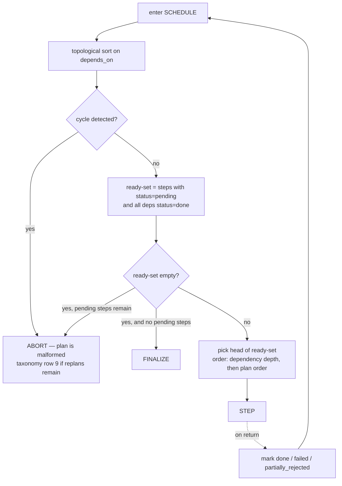
```mermaid
flowchart TD
  S["enter SCHEDULE"] --> TS["topological sort on depends_on"]
  TS --> CYC{"cycle detected?"}
  CYC -->|yes| AB["ABORT — plan is malformed<br/>taxonomy row 9 if replans remain"]
  CYC -->|no| RS["ready-set = steps with status=pending<br/>and all deps status=done"]
  RS --> EMPTY{"ready-set empty?"}
  EMPTY -->|"yes, and no pending steps"| FIN["FINALIZE"]
  EMPTY -->|"yes, pending steps remain"| AB
  EMPTY -->|no| PICK["pick head of ready-set<br/>order: dependency depth, then plan order"]
  PICK --> STEP["STEP"]
  STEP -.->|"on return"| MARK["mark done / failed / partially_rejected"]
  MARK --> S
```

Re-entry points into `SCHEDULE` — each recomputes the ready-set from scratch, which is why requeueing is a status write and nothing more:

| From | What changed before re-entry |
|---|---|
| `STEP` | one step marked `done` |
| `MILESTONE` | a batch confirmed green |
| `RECOVER` (revert) | reverted steps reset to `pending`, blast radius reset with them |
| `REPLAN` | plan replaced at a new `revision`; completed steps outside the replanned subtree keep `done` |
| `HITL` (partial) | steps owning rejected hunks reset to `pending` with a rejection constraint attached |

---

## 6. STEP — the execution loop

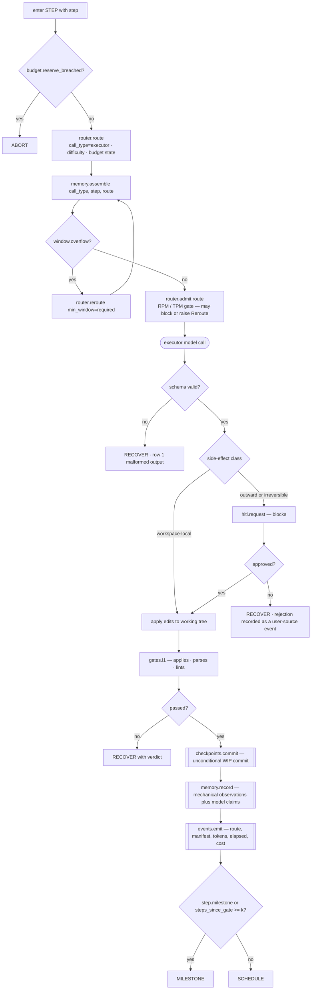
```mermaid
flowchart TD
  IN["enter STEP with step"] --> BUD{"budget.reserve_breached?"}
  BUD -->|yes| ABT["ABORT"]
  BUD -->|no| RTE["router.route<br/>call_type=executor · difficulty · budget state"]
  RTE --> ASM["memory.assemble call_type, step, route"]
  ASM --> OVF{"window.overflow?"}
  OVF -->|yes| RRT["router.reroute min_window=required"]
  RRT --> ASM
  OVF -->|no| ADM["router.admit route<br/>RPM / TPM gate — may block or raise Reroute"]
  ADM --> CALL(["executor model call"])
  CALL --> VAL{"schema valid?"}
  VAL -->|no| R1["RECOVER · row 1 malformed output"]
  VAL -->|yes| SIDE{"side-effect class"}
  SIDE -->|"outward or irreversible"| HIT["hitl.request — blocks"]
  SIDE -->|"workspace-local"| APP
  HIT --> DEC{"approved?"}
  DEC -->|no| R11["RECOVER · rejection recorded as a user-source event"]
  DEC -->|yes| APP["apply edits to working tree"]
  APP --> L1["gates.l1 — applies · parses · lints"]
  L1 --> PASS{"passed?"}
  PASS -->|no| RCV["RECOVER with verdict"]
  PASS -->|yes| CK[["checkpoints.commit — unconditional WIP commit"]]
  CK --> FCT[["memory.record — mechanical observations plus model claims"]]
  FCT --> EVT[["events.emit — route, manifest, tokens, elapsed, cost"]]
  EVT --> MS{"step.milestone or steps_since_gate >= k?"}
  MS -->|yes| MIL["MILESTONE"]
  MS -->|no| SCH["SCHEDULE"]
```

Two orderings in this diagram are decisions, not accidents:

- **route before assemble** — routing depends on `call_type`, `difficulty` and budget, never on context size. Assembling first would cap every prompt at the smallest window in the pool (Cerebras free tier: 8192) and waste the 128K available elsewhere.
- **checkpoint before step events** — a step's events must point at a commit that exists, or a revert has no `seq` boundary to recompute views against.

---

## 7. Route → assemble → admit, and the overflow ladder

A context-limit error from a provider is unreachable by construction: every window is tokenizer-counted with a 5% margin before dispatch.

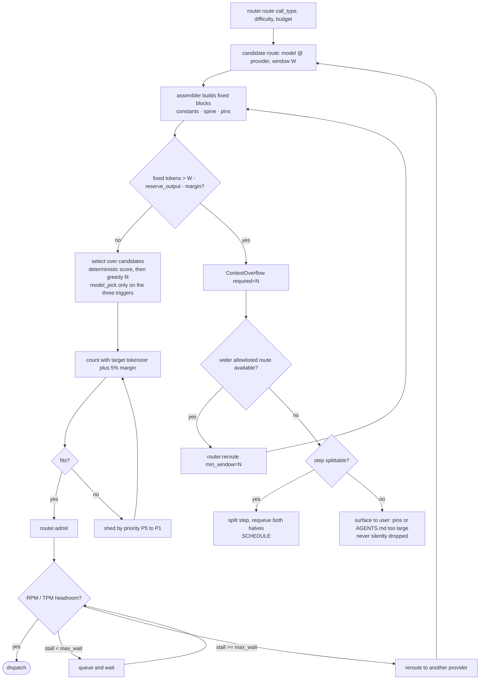
```mermaid
flowchart TD
  A["router.route call_type, difficulty, budget"] --> B["candidate route: model @ provider, window W"]
  B --> C["assembler builds fixed blocks<br/>constants · spine · pins"]
  C --> D{"fixed tokens > W - reserve_output - margin?"}
  D -->|no| E["select over candidates<br/>deterministic score, then greedy fit<br/>model_pick only on the three triggers"]
  E --> F["count with target tokenizer plus 5% margin"]
  F --> G{"fits?"}
  G -->|yes| H["router.admit"]
  G -->|no| I["shed by priority P5 to P1"]
  I --> F
  D -->|yes| J["ContextOverflow required=N"]
  J --> K{"wider allowlisted route available?"}
  K -->|yes| L["router.reroute min_window=N"]
  L --> C
  K -->|no| M{"step splittable?"}
  M -->|yes| N["split step, requeue both halves<br/>SCHEDULE"]
  M -->|no| O["surface to user: pins or AGENTS.md too large<br/>never silently dropped"]
  H --> P{"RPM / TPM headroom?"}
  P -->|yes| Q(["dispatch"])
  P -->|"stall < max_wait"| R["queue and wait"]
  R --> P
  P -->|"stall >= max_wait"| S["reroute to another provider"]
  S --> B
```

Under free-tier TPM caps, an oversized window converts directly into wall-clock stall. Token frugality here is a **latency** optimisation, not a cost one — cost is ~0 on the free path, time is weighted 0.35 in the score.

---

## 8. Provider failover — taxonomy row 2

The only handler that changes provider while holding the model fixed. Separated because it interacts with admission control rather than with the plan.

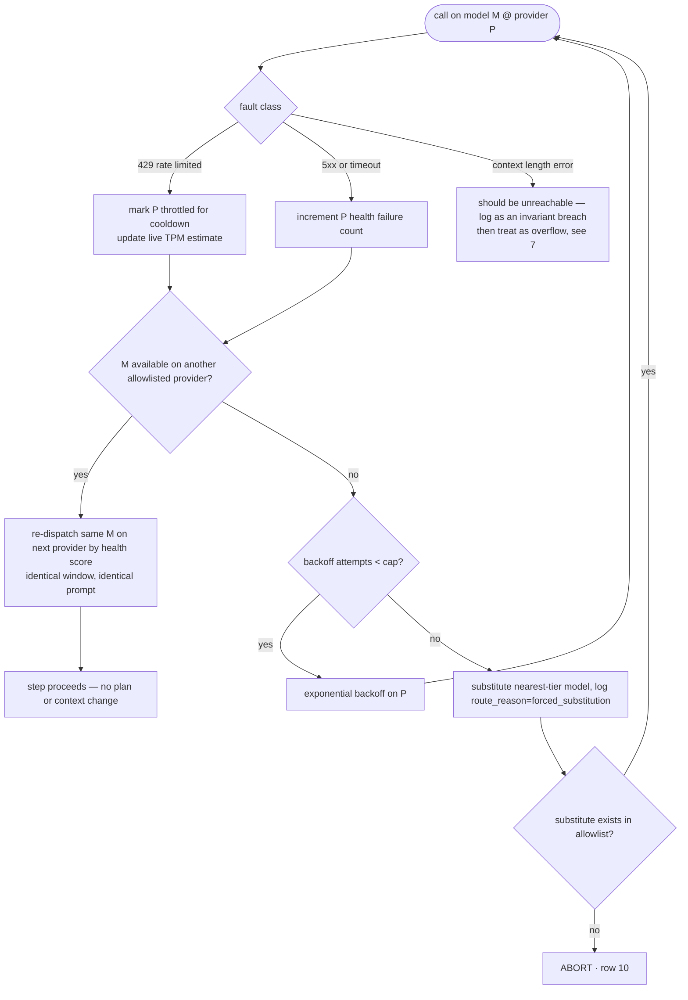
```mermaid
flowchart TD
  A(["call on model M @ provider P"]) --> B{"fault class"}
  B -->|"429 rate limited"| C["mark P throttled for cooldown<br/>update live TPM estimate"]
  B -->|"5xx or timeout"| D["increment P health failure count"]
  B -->|"context length error"| E["should be unreachable — log as an invariant breach<br/>then treat as overflow, see 7"]
  C --> F{"M available on another allowlisted provider?"}
  D --> F
  F -->|yes| G["re-dispatch same M on next provider by health score<br/>identical window, identical prompt"]
  F -->|no| H{"backoff attempts < cap?"}
  H -->|yes| I["exponential backoff on P"]
  I --> A
  H -->|no| J["substitute nearest-tier model, log route_reason=forced_substitution"]
  J --> K{"substitute exists in allowlist?"}
  K -->|yes| A
  K -->|no| L["ABORT · row 10"]
  G --> M["step proceeds — no plan or context change"]
```

Failover is safe precisely because there is no rolling transcript: each call is assembled fresh from durable state, so a mid-task provider or model swap cannot inherit another model's chat formatting.

---

## 9. Verification gate ladder

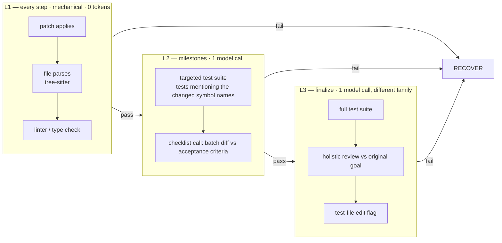
```mermaid
flowchart LR
  subgraph L1["L1 — every step · mechanical · 0 tokens"]
    A1["patch applies"] --> A2["file parses<br/>tree-sitter"] --> A3["linter / type check"]
  end
  subgraph L2["L2 — milestones · 1 model call"]
    B1["targeted test suite<br/>tests mentioning the changed symbol names"] --> B2["checklist call: batch diff vs acceptance criteria"]
  end
  subgraph L3["L3 — finalize · 1 model call, different family"]
    C1["full test suite"] --> C2["holistic review vs original goal"] --> C3["test-file edit flag"]
  end
  L1 -->|pass| L2
  L2 -->|pass| L3
  L1 -->|fail| R["RECOVER"]
  L2 -->|fail| R
  L3 -->|fail| R
```

| Layer | Runs | Cost | Catches |
|---|---|---|---|
| L1 | every step | free | broken patches, syntax, lint — stops state pollution immediately |
| L2 | milestone, cadence `k` | one call | batch drift from acceptance criteria; regressions in dependents |
| L3 | once, at finalize | one call, **different model family** | plan-level misunderstanding — a green suite that solves the wrong problem |

Two properties worth stating: L2/L3 use a different model family from the executor so errors decorrelate, and any diff that edits a **test file** is flagged for human eyes regardless of verdict — a model rewriting a failing test is self-sabotage under a hidden-test score.

---

## 10. RECOVER — failure taxonomy dispatch

Dispatch is on **first matching row**. Detection is mechanical for eight of ten rows; the Diagnostician model is called only for rows 5 and 9.

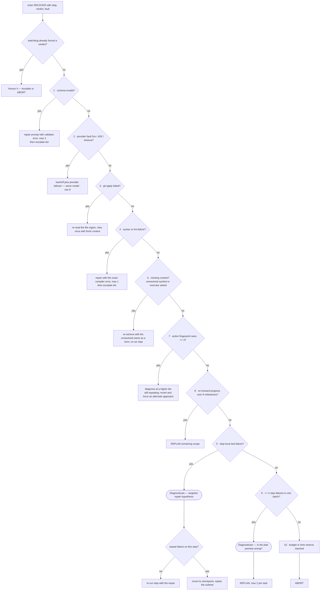
```mermaid
flowchart TD
  IN["enter RECOVER with step, verdict, fault"] --> W{"watchdog already forced a verdict?"}
  W -->|yes| WD["honour it — escalate or ABORT"]
  W -->|no| R1{"1 · schema invalid?"}
  R1 -->|yes| H1["repair prompt with validator error, max 2<br/>then escalate tier"]
  R1 -->|no| R2{"2 · provider fault 5xx / 429 / timeout?"}
  R2 -->|yes| H2["backoff plus provider failover — same model · see 8"]
  R2 -->|no| R3{"3 · git apply failed?"}
  R3 -->|yes| H3["re-read the file region, retry once with fresh context"]
  R3 -->|no| R4{"4 · syntax or lint failure?"}
  R4 -->|yes| H4["repair with the exact compiler error, max 1<br/>then escalate tier"]
  R4 -->|no| R6{"6 · missing context?<br/>unresolved symbol or executor asked"}
  R6 -->|yes| H6["re-retrieve with the unresolved name as a term, re-run step"]
  R6 -->|no| R7{"7 · action fingerprint seen >= 3?"}
  R7 -->|yes| H7["diagnose at a higher tier<br/>still repeating: revert and force an alternate approach"]
  R7 -->|no| R8{"8 · no forward progress over N milestones?"}
  R8 -->|yes| H8["REPLAN remaining scope"]
  R8 -->|no| R5{"5 · step-local test failure?"}
  R5 -->|yes| D5(["Diagnostician — targeted repair hypothesis"])
  D5 --> H5{"repeat failure on this step?"}
  H5 -->|no| RS["re-run step with the repair"]
  H5 -->|yes| RV["revert to checkpoint, replan the subtree"]
  R5 -->|no| R9{"9 · >= 2 step failures in one batch?"}
  R9 -->|yes| D9(["Diagnostician — is the plan premise wrong?"])
  D9 --> H9["REPLAN, max 2 per task"]
  R9 -->|no| R10["10 · budget or time reserve reached"]
  R10 --> H10["ABORT"]
```

Row-ordering rationale, in one line each: cheap mechanical classes are tested before expensive ones; repetition (7) and stagnation (8) are checked **before** the model-assisted rows so a loop cannot be diagnosed forever; row 10 is the catch-all floor.

| Row | Changes | Costs |
|---|---|---|
| 1, 4 | model **tier** | one repair call |
| 2 | **provider**, not model | backoff time only |
| 3, 6 | **context** | one retrieval pass, including its one `choose` call |
| 5, 9 | **approach** | one diagnosis call, possibly a revert |
| 7 | approach, forcibly | tier bump plus revert |
| 8 | scope | one planner call |
| 10 | nothing — terminates | zero |

**No row retries an identical action.** Row 2 is the closest, and it changes the endpoint.

---

## 11. The escalation ladder and its counters

Every recovery path walks the same ladder, and every rung has a cap. When caps are exhausted the run does not hang — it aborts and still emits a diff.

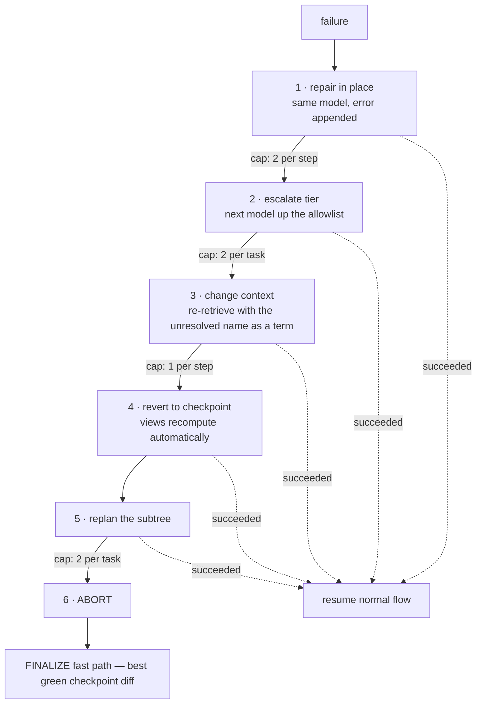
```mermaid
flowchart TD
  A["failure"] --> B["1 · repair in place<br/>same model, error appended"]
  B -->|"cap: 2 per step"| C["2 · escalate tier<br/>next model up the allowlist"]
  C -->|"cap: 2 per task"| D["3 · change context<br/>re-retrieve with the unresolved name as a term"]
  D -->|"cap: 1 per step"| E["4 · revert to checkpoint<br/>views recompute automatically"]
  E --> F["5 · replan the subtree"]
  F -->|"cap: 2 per task"| G["6 · ABORT"]
  G --> H["FINALIZE fast path — best green checkpoint diff"]
  B -.->|"succeeded"| Z["resume normal flow"]
  C -.->|"succeeded"| Z
  D -.->|"succeeded"| Z
  E -.->|"succeeded"| Z
  F -.->|"succeeded"| Z
```

Counters live on the task row, are written to the event store on every increment, and are restored by replay on `RESUME` — a crash cannot reset a budget by forgetting it.

---

## 12. Watchdog — cross-cutting overlay

Not a state. A subscriber on the event stream that can force a transition from any non-terminal state.

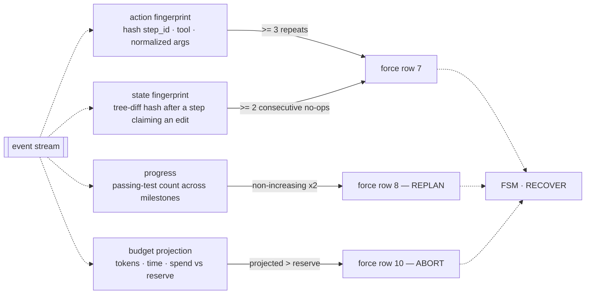
```mermaid
flowchart LR
  EV[["event stream"]] -.-> D1["action fingerprint<br/>hash step_id · tool · normalized args"]
  EV -.-> D2["state fingerprint<br/>tree-diff hash after a step claiming an edit"]
  EV -.-> D3["progress<br/>passing-test count across milestones"]
  EV -.-> D4["budget projection<br/>tokens · time · spend vs reserve"]
  D1 -->|">= 3 repeats"| A1["force row 7"]
  D2 -->|">= 2 consecutive no-ops"| A1
  D3 -->|"non-increasing x2"| A2["force row 8 — REPLAN"]
  D4 -->|"projected > reserve"| A3["force row 10 — ABORT"]
  A1 -.-> FSM["FSM · RECOVER"]
  A2 -.-> FSM
  A3 -.-> FSM
```

**Can force a transition from:** `STEP`, `MILESTONE`, `RECOVER`, `REPLAN`, `SCHEDULE`.
**Cannot interrupt:** `HITL` (a human is mid-decision), `FINALIZE` (already terminating), `INTAKE`/`SCOPE` (nothing to loop on).

The progress detector is **armed only when the baseline suite has ≥1 passing test**, otherwise a repo receiving its first tests reads as permanent stagnation.

---

## 13. Checkpoint, revert, blast radius

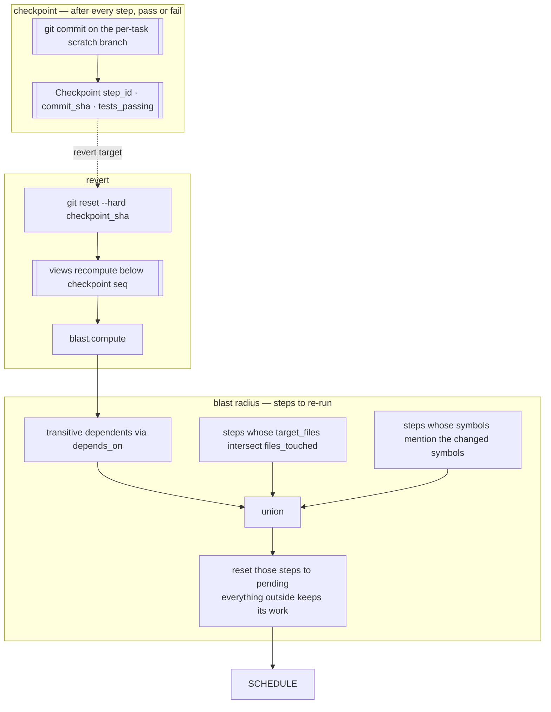
```mermaid
flowchart TD
  subgraph CK["checkpoint — after every step, pass or fail"]
    A[["git commit on the per-task scratch branch"]] --> B[["Checkpoint step_id · commit_sha · tests_passing"]]
  end
  subgraph RV["revert"]
    C["git reset --hard checkpoint_sha"] --> D[["views recompute below checkpoint seq"]]
    D --> E["blast.compute"]
  end
  subgraph BR["blast radius — steps to re-run"]
    F["transitive dependents via depends_on"] --> I["union"]
    G["steps whose target_files intersect files_touched"] --> I
    H["steps whose symbols mention the changed symbols"] --> I
    I --> J["reset those steps to pending<br/>everything outside keeps its work"]
  end
  B -.->|"revert target"| C
  E --> F
  J --> K["SCHEDULE"]
```

- Checkpoints are **unconditional** — a failed step still commits, because bisection granularity depends on having a commit per step.
- Revert is **code only**. Memory holds no independently-written claims to roll back — its views are functions of the event log, so they recompute against the checkpoint's `seq` for free (`05-memory-context.md` §9).
- Blast radius requires **hunk → step provenance** captured at diff-generation time. It cannot be retrofitted, so it is written from day one.

Consequence: every step starts from a clean checkpoint and is therefore **idempotent**. There is no separate crash-recovery code path — resume is just revert plus re-run.

---

## 14. FINALIZE — three entry modes

The distinction the state table elides: an aborting task must not pay for the L3 model call it can no longer act on, and a `micro_edit` must not pay for L3 at all.

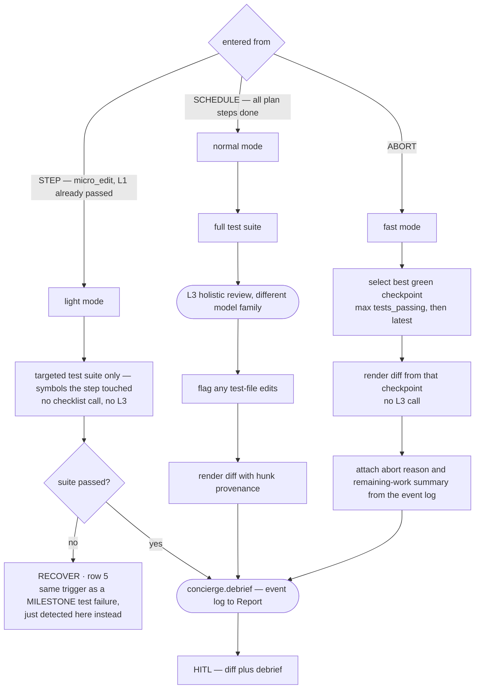
```mermaid
flowchart TD
  A{"entered from"} -->|"SCHEDULE — all plan steps done"| N["normal mode"]
  A -->|"ABORT"| F["fast mode"]
  A -->|"STEP — micro_edit, L1 already passed"| L["light mode"]
  N --> N1["full test suite"] --> N2(["L3 holistic review, different model family"]) --> N3["flag any test-file edits"] --> N4["render diff with hunk provenance"]
  F --> F1["select best green checkpoint<br/>max tests_passing, then latest"] --> F2["render diff from that checkpoint<br/>no L3 call"]
  F2 --> F3["attach abort reason and remaining-work summary from the event log"]
  L --> L1["targeted test suite only — symbols the step touched<br/>no checklist call, no L3"]
  L1 --> LP{"suite passed?"}
  LP -->|no| RCV["RECOVER · row 5<br/>same trigger as a MILESTONE test failure,<br/>just detected here instead"]
  LP -->|yes| D
  N4 --> D(["concierge.debrief — event log to Report"])
  F3 --> D
  D --> H["HITL — diff plus debrief"]
```

Fast mode exists because of the scoring geometry: hitting the 2700 s wall scores 0, while a graceful partial diff at 1200 s with A≈0.4 still scores ~2. **Never touch the wall.**

**Every mode now carries one Concierge call, not zero.** Before §3a, fast mode made zero model calls; it now makes one — the debrief — because a human staring at a bare diff or an abort with no narration is precisely the gap that made "boss agent, gateway at the end" the right closing half of this design. It stays cheap: `debrief` reads the event log, not the working tree, and runs on the same tier as `classify`. "Zero model calls" in earlier text now means zero *heavy* calls; the debrief is the one exception, everywhere.

**Light mode is deliberately thinner than fast mode, not a smaller version of normal mode.** No L3, no cross-family review, no checklist call — those exist to catch a wrong plan, and a `micro_edit` has no plan to be wrong about. The targeted suite is the one check worth keeping: a rename can break a caller L1's lint pass never sees.

**Re-entry after a partial approval:** L3 re-runs on the full tree, not only the re-run subset — accepted hunks and freshly re-run hunks interact, and the full suite is the only check that sees the composition. The holistic review is **not** skipped on re-entry. A partial rejection is direct human evidence that the plan was partly wrong, which is precisely what the cross-family review exists to catch — skipping it on the one run where a human just rejected work inverts the gate's purpose. One extra call is close to free in score terms; a missed plan-level error is not. (This is normal-mode-only — a light-mode task promoted by a partial rejection re-enters through `RECOVER → REPLAN`, per §3a, and comes back through normal mode with a real plan.)

---

## 15. HITL and partial approval

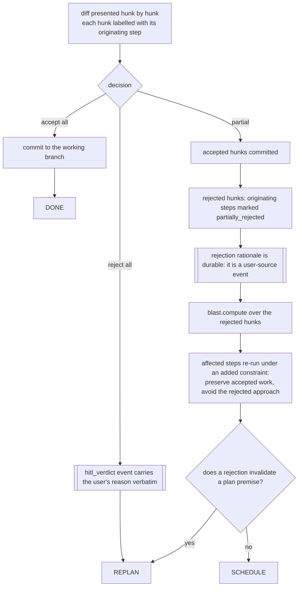
```mermaid
flowchart TD
  A["diff presented hunk by hunk<br/>each hunk labelled with its originating step"] --> B{"decision"}
  B -->|"accept all"| C["commit to the working branch"] --> D["DONE"]
  B -->|"reject all"| E[["hitl_verdict event carries the user's reason verbatim"]] --> F["REPLAN"]
  B -->|"partial"| G["accepted hunks committed"]
  G --> H["rejected hunks: originating steps marked partially_rejected"]
  H --> I[["rejection rationale is durable: it is a user-source event"]]
  I --> J["blast.compute over the rejected hunks"]
  J --> K["affected steps re-run under an added constraint:<br/>preserve accepted work, avoid the rejected approach"]
  K --> L{"does a rejection invalidate a plan premise?"}
  L -->|yes| F
  L -->|no| M["SCHEDULE"]
```

Rejections are durable for free: the verdict *is* an event, and the reason *is* the user's own text — nothing paraphrases it and nothing has to re-derive it. The `rejections` view (`05-memory-context.md` §2) renders it into every later window. Without that record, the agent re-proposes the rejected approach after the next replan — the single most irritating failure mode in a review loop. `source == "user"` also makes it the only kind of text allowed to become a binding constraint (§7 there).

**A `micro_edit` origin has no `SCHEDULE` to re-enter.** Partial accept on a light-mode diff — a real case, since one step can still produce more than one hunk — cannot land on `L`'s `SCHEDULE` branch the way a task-plan diff does; there is no plan for a reset status to belong to. It takes the same edge reject-all takes: `REPLAN`, with the accepted hunks and the rejection both already durable as events. `REPLAN` builds the first plan either way — the accepted work just isn't undone by it. Accept-all is unaffected; it never touches `SCHEDULE`.

### Approval classes

| Class | Examples | Policy |
|---|---|---|
| workspace-local | edits on the scratch branch, reads, tests, lint | unattended; the final hunk review is the gate |
| outward / irreversible | `git push`, package install, writes outside the workspace, state-changing shell | inline block, **every time**, no batching |

`strict_mode` promotes every write to an inline approval and is **on by default** ([`11-tools.md`](11-tools.md) §3.2); turning it off is what a user does once they trust the agent on that repo.

---

## 16. RESUME — crash, IDE close, machine restart

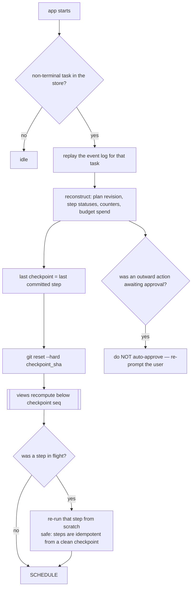
```mermaid
flowchart TD
  A["app starts"] --> B{"non-terminal task in the store?"}
  B -->|no| Z["idle"]
  B -->|yes| C["replay the event log for that task"]
  C --> D["reconstruct: plan revision, step statuses, counters, budget spend"]
  D --> E["last checkpoint = last committed step"]
  E --> F["git reset --hard checkpoint_sha"]
  F --> G[["views recompute below checkpoint seq"]]
  G --> H{"was a step in flight?"}
  H -->|yes| I["re-run that step from scratch<br/>safe: steps are idempotent from a clean checkpoint"]
  H -->|no| J["SCHEDULE"]
  I --> J
  D --> K{"was an outward action awaiting approval?"}
  K -->|yes| L["do NOT auto-approve — re-prompt the user"]
```

Resume needs no special memory handling: there is no in-memory conversation to restore, so the assembler simply reads the store. The only genuinely unsafe case is an outward side effect that was mid-approval — never resumed silently.

---

## 17. Budget, time, and the abort calculus

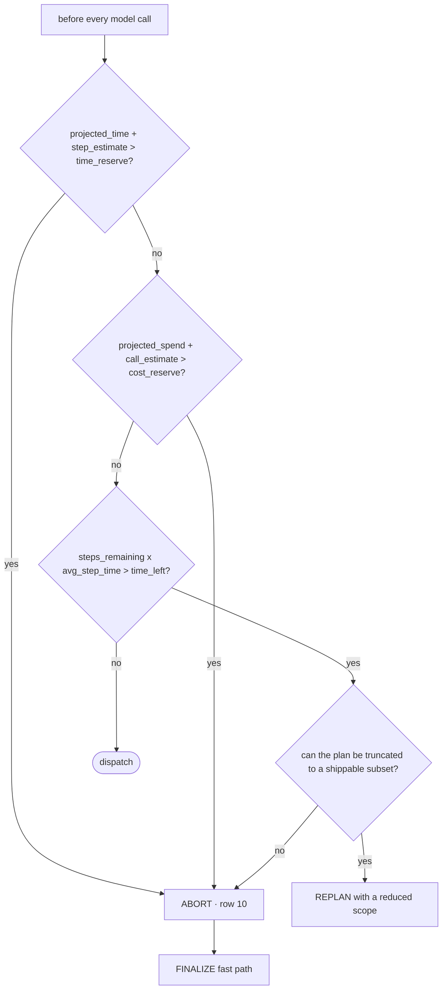
```mermaid
flowchart TD
  A["before every model call"] --> B{"projected_time + step_estimate > time_reserve?"}
  B -->|yes| X["ABORT · row 10"]
  B -->|no| C{"projected_spend + call_estimate > cost_reserve?"}
  C -->|yes| X
  C -->|no| D{"steps_remaining x avg_step_time > time_left?"}
  D -->|yes| E{"can the plan be truncated to a shippable subset?"}
  E -->|yes| F["REPLAN with a reduced scope"]
  E -->|no| X
  D -->|no| G(["dispatch"])
  X --> Y["FINALIZE fast path"]
```

Reserve, not limit: the reserve is set so that the abort path — select checkpoint, render diff, write trace — completes comfortably inside the remaining time. The wall is never the trigger; the reserve is.

```mermaid
gantt
    title Time budget for one task — 2700 s hard wall
    dateFormat X
    axisFormat %s
    section Plan
    scope and plan            :0, 120
    section Execute
    steps with L1 gates       :120, 1500
    milestone L2 gates        :1500, 1700
    section Finish
    L3 plus diff render       :1700, 1900
    section Reserve
    abort reserve — never spent on model calls :1900, 2400
    section Wall
    hard wall — score 0 beyond :2400, 2700
```

---

## 18. Concurrency and admission

```mermaid
flowchart TB
  subgraph SER["Serialised — single writer"]
    A["working-tree mutation"]
    B["git commits and checkpoints"]
    C["plan and step-status writes"]
  end
  subgraph PAR["Parallel — width set by live rate limits"]
    D["retrieval queries"]
    E["independent test subsets"]
    F["per-criterion checklist calls"]
    G["diagnosis calls on distinct steps"]
  end
  ADM["router.admit — remaining RPM and TPM per provider"] --> PAR
  ADM --> SER
  ADM -.->|"no headroom"| Q["queue, then reroute if the stall exceeds max_wait"]
```

Concurrency width is **not a constant**. It is whatever the live provider budget allows, which on free tiers is typically one to two streams. Parallel *writes* — worktree per sequence plus a merged-tests gate — stay deferred until the eval harness shows serialisation is actually the bottleneck.

---

## 19. Event emission map

Every row below is written before the transition is considered to have happened; replay is therefore exact. [`09-event-store.md`](09-event-store.md) §1 owns the canonical `kind` enum — this table is the emission map, not a second definition of the schema.

| Transition / point | Event type | Carries |
|---|---|---|
| task created | `transition` | `from: null → to: INTAKE`, plus prompt, project_id, config snapshot |
| any state change | `transition` | from, to, guard that fired |
| before a model call | `call_start` | call_type, model, provider, `route_reason`, **context manifest** |
| after a model call | `call_end` | tokens in/out, elapsed_ms, cost, raw output ref |
| tool invocation | `tool_call` | tool, args, side-effect class, exit code, stdout/stderr |
| diff generated | `diff` | hunks with **hunk→step provenance** ([`08-hitl.md`](08-hitl.md) §2) |
| user prompt, pin, unpin, aside | `user_input` | text or pin ref; `source: "user"` — the only kind that can bind ([`05`](05-memory-context.md) §7) |
| approval request | `hitl_request` / `hitl_decision` | action, decision, rationale |
| gate run | `gate` | layer, verdict, failing criteria or test ids |
| checkpoint | `checkpoint` | step_id, commit_sha, tests_passing |
| recovery dispatch | `recovery` | taxonomy row, handler, counter state |
| watchdog trip | `watchdog` | detector, threshold, forced action |
| abort | `abort` | reason, projected vs reserve, chosen checkpoint |

`context_manifest` is the one field that cannot be reconstructed after the fact — exactly which files and chunks entered a call. It is what makes a trace answer "why did it do that", and it is written at call time or never.

---

## 20. Failure reachability matrix

Which taxonomy rows can fire from which state, and where each lands. This is the table that shows recovery is *diagnosed*, not blind.

| State | Rows reachable | Typical landing |
|---|---|---|
| `INTAKE` | — | none; no model call |
| `TRIAGE` | 1, 2, 10 | same pattern as `PLAN` — 1 → repair then tier escalation → `ABORT`; 2 → failover; 10 → `ABORT` |
| `RESPOND` | 1, 2, 10 | same pattern as `PLAN` |
| `SCOPE` | — | deterministic, no model call |
| `BRIEF` | 1, 2, 10 | same pattern as `PLAN` |
| `PLAN` | 1, 2, 10 | 1 → repair then tier escalation → `ABORT`; 2 → failover; 10 → `ABORT` |
| `SCHEDULE` | 9, 10 | cycle or orphan dep → `REPLAN` / `ABORT` |
| `STEP` | 1, 2, 3, 4, 5, 6, 7, 10 | `STEP` for 1/2/3/4/6; `SCHEDULE` after revert for 5/7; `ABORT` for 10. For `micro_edit`, row 5 does not fire here — its test suite runs at `FINALIZE(light)` instead. |
| `MILESTONE` | 2, 5, 8, 9, 10 | 5 → targeted repair; 8/9 → `REPLAN`; 10 → `ABORT` |
| `RECOVER` | 2, 10 | recursion is bounded by counters; exhaustion → `ABORT` |
| `REPLAN` | 1, 2, 9, 10 | 1 → repair; 9 with budget spent → `ABORT`. For a promoted `micro_edit`, this row set governs the *first* plan, not a revision. |
| `FINALIZE` normal | 2, 5, 10 | L3 failure → `RECOVER`; wall pressure → fast mode |
| `FINALIZE` fast | 10 | budget check before the debrief call; otherwise no model failure classes |
| `FINALIZE` light | 2, 5, 10 | 5 → targeted-suite failure → `RECOVER`, same handler as a `MILESTONE` row-5 hit |
| `HITL` | — | human decisions do not fail; timeouts leave the task parked, not aborted |
| `RESUME` | — | replay only |

Rows 3, 4, 6, 7 are `STEP`-only by construction — they describe editing, and only `STEP` edits.

---

## 21. Worked trace — a failure that recovers

Concrete path through the machinery: a plan whose second step edits a file the executor has stale context on.

```mermaid
sequenceDiagram
    autonumber
    participant F as FSM
    participant R as Router
    participant A as Assembler
    participant L as Executor
    participant D as Diagnostician
    participant G as Gates
    participant W as Watchdog

    F->>L: s2 · add @require_auth to admin route
    L-->>F: StepResult, edits routes/admin.py
    F->>G: L1
    G-->>F: pass
    Note over F: checkpoint c2 committed

    F->>L: s3 · update the auth test
    L-->>F: patch
    F->>G: L1
    G-->>F: fail — git apply, context stale
    F->>F: RECOVER · row 3
    F->>A: re-read the file region, fresh context
    F->>L: s3 retry
    L-->>F: patch applies
    F->>G: L1 pass, then milestone L2
    G-->>F: fail — 2 tests red

    F->>F: RECOVER · row 5
    F->>D: diagnose against test output and diff
    D-->>F: decorator applied to the wrong function
    F->>L: targeted repair
    L-->>F: patch
    F->>G: L2 rerun
    G-->>F: fail again, same tests
    Note over W: same action fingerprint x3
    W-->>F: force row 7
    F->>F: revert to c2, views recompute below c2
    F->>R: escalate tier for the retry
    F->>L: s3 at a higher tier, alternate approach forced
    L-->>F: patch
    F->>G: L2
    G-->>F: pass
    F->>F: SCHEDULE
```

Read the recovery ladder in that trace: **change context** (row 3) → **change approach** (row 5) → **revert and change tier** (row 7). Three distinct interventions, none of them a repeat of the previous action.

---

## 22. What these diagrams expose

Drawing every path surfaced decisions that the prose left implicit. Recorded here so they are answered deliberately rather than discovered in code:

| Point | Resolution taken above |
|---|---|
| `ABORT → FINALIZE` still paying for a model call | §14 — three entry modes; fast mode now makes exactly one, the debrief — no heavy calls |
| L3 scope after a partial approval | §14 — full tree, capped at two L3 calls per task |
| Watchdog reach | §12 — explicit allow/deny list of interruptible states |
| `SCHEDULE` with an empty ready-set and pending work | §5 — `ABORT`; the plan has a cycle or an orphaned dependency |
| Resume across a pending approval | §16 — re-prompt, never auto-approve |
| Where step-splitting lives | §7 — an overflow resolution, not a recovery row |
| Trivial requests paying full-task cost | §3a — `TRIAGE` front door; `chat`/`lookup`/`micro_edit` skip planning entirely |
| Where a framed brief gets its grounding | §3a — after `SCOPE`, never before; additive to the verbatim prompt, never a replacement |
| How a misclassified `lookup` or `micro_edit` escalates | §3a — no new promotion state; `lookup` uses a schema slot (`requires_edits`), `micro_edit` reuses `RECOVER → REPLAN` off a relocated row-5 trigger |
| Partial HITL accept on a plan-less (`micro_edit`) diff | §15 — no `SCHEDULE` to re-enter; takes the `REPLAN` edge, same as reject-all |

Still open, deliberately:

- Should a step-split emit a plan revision, or stay invisible to the plan? Currently invisible — cheaper, but it makes traces harder to read against the plan.
- `HITL` timeout policy: parked tasks hold a scratch branch indefinitely. Needs a retention rule.
- Whether row 7's forced-alternate prompt can be expressed mechanically, or needs a diagnosis call to describe what "alternate" means.
- `TRIAGE`'s misclassification cost is still asymmetric even with `requires_edits` shared across `chat` and `lookup`: catching a mistake costs a full extra round trip through `RESPOND` before the promotion fires, versus one wasted `SCOPE`/`BRIEF` pass if `chat` is over-classified as `task`. Whether that asymmetry is worth correcting, or the eval harness's misroute-rate metric (config knobs, `02-orchestration.md` §14) is enough to tune `TRIAGE`'s bias without it, is unresolved.
- `REPLAN` plans against `SCOPE`'s original repo map and `BRIEF`'s original grounding, even though completed steps have since edited the tree. Neither re-runs. Stale enough to matter, or does the `touched` view (`05-memory-context.md` §2) cover the drift?
- `RESUME` (§16) keys off "last checkpoint = last committed step," but `INTAKE` creates the scratch branch lazily, on first write — `chat`/`lookup` never write, so a crash mid-`RESPOND` has no checkpoint to reconstruct from. No guard for this case exists yet.
- Debrief is uncapped across `HITL` partial-accept loops: `FINALIZE` re-enters on every partial accept, and each re-entry pays another `concierge.debrief` call. L3 has an explicit two-per-task cap (§14); debrief doesn't.
- `concierge.classify`'s prompt is now a load-bearing spec artifact — the eval harness's misroute-rate metric is only as meaningful as that prompt is stable — but it has no home: not versioned, not owned by any doc section, not distinguished from a tunable config knob the way `02-orchestration.md` §14 treats other knobs.
- Cross-task continuity is unaddressed: nothing in `02-orchestration.md`/`02a` or `05-memory-context.md` says whether a follow-up prompt after `DONE` starts a cold `INTAKE` with zero awareness of the prior task, or whether anything (project-scoped views, the prior `Report`) carries forward. `05-memory-context.md` §"no agent ever holds a conversation" covers within-task windowing only.
