# Orchestration FSM — Comprehensive Mermaid Graph

> Generated from `server/agentzero/agent/orchestrator.py` (1685 LOC), `server/agentzero/agent/workers.py`, `server/agentzero/agent/router.py`, `server/agentzero/agent/tools.py`, `server/agentzero/agent/types.py` — current working tree 2026-09-02.
> Companion to `ORCHESTRATOR-FLOW.md` (per-section diagrams) and `ARCHITECTURE.md` (rationale). This file is the **single unified FSM** stitching every control path into one observable machine.

## Legend

| Shape | Meaning | Origin |
|---|---|---|
| `[*] --> S` | entry / creation | `orchestrator.py:232` `run_task()` |
| `S --> [*]` | terminal return `TaskOutcome` | `orchestrator.py:540` / `568` |
| `A["..."]` rectangle | deterministic code — no model call | `orchestrator.py:1-27` invariant |
| `B(["..."])` rounded | model call (schema-validated) | `workers.py:12-14` |
| `C{"..."}` diamond | mechanical predicate / guard | `orchestrator.py:954` `TAXONOMY` etc. |
| `D[["..."]]` subroutine | durable write — `Store` / `Checkpoints` / `NewEvent` | `store.py` + `checkpoints.py` |
| `--> dashed` | cooperative signal (`CancelToken`, `request_stop`) | `orchestrator.py:161` |
| `note` | constants / budgets | `orchestrator.py:60-84`, `router.py:77-84` |

> **Invariant** (`orchestrator.py:11`): *Control flow is NEVER delegated to a model. Models fill typed slots (Plan, Turn, FailureClass, BatchReview); the loop decides what happens next.*

---

## 1. Master FSM — `run_task()` as a single state machine

`stateDiagram-v2` view. Every edge is taken by code; no model ever chooses an edge.

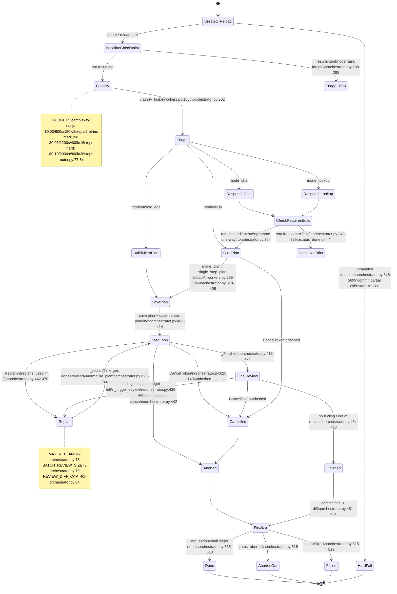

### State table

| State |Entered by |Terminal? |DB write |Source|
|---|---|---|---|---|
|`CreateOrReload`|`resume_task_id` branch |no |`create_task` / `get_task`+`set_status(running)` |`orchestrator.py:244-269`|
|`BaselineCheckpoint`|`checkpoints.init()` or reuse |no |`set_base_sha`, `checkpoint` event |`orchestrator.py:271-285`|
|`Classify`|fresh task |no |`llm_call` event |`orchestrator.py:302`, `workers.py:155`|
|`Triage`|`Classification.mode` |no |— |`workers.py:101-123`|
|`Respond_Chat/Lookup`|`mode in (chat,lookup)` |no |`tool_call:retrieve` (lookup 6 chunks), `web_search` (if web_query), `answer_*` |`orchestrator.py:312-347`|
|`CheckRequiresEdits`|`Answer.requires_edits` |branch |`task_end` if false |`orchestrator.py:348-364`|
|`BuildPlan/MicroPlan`|retrieval + file list |no |`tool_call:retrieve` (10 chunks), `plan` |`orchestrator.py:367-405`|
|`SavePlan`|`save_plan` + `upsert_step(pending)` |no |`steps` rows |`orchestrator.py:406-414`|
|`StepLoop`|`_run_steps()` |loop |`step_start/step_end`, `verify`, `checkpoint`, `review` |`orchestrator.py:601-692`|
|`FinalReview`|`_run_final_review()` |branch |`review` events |`orchestrator.py:419-437`, `768-800`|
|`Replan`|`_replan()` |loop |`tool_call:replan`, new `Plan` |`orchestrator.py:695-760`|
|`Finalize`|commit + diff |no |`checkpoint:final`, `task_end` |`orchestrator.py:481-538`|
|`Done/Aborted/Failed`|`TaskOutcome` |**yes** |`set_status` |`orchestrator.py:515-544`|
|`HardFail`|catch-all `except` |**yes** |`error` event, partial diff |`orchestrator.py:546-569`|

---

## 2. Triage Branching — `mode` as a deterministic switch

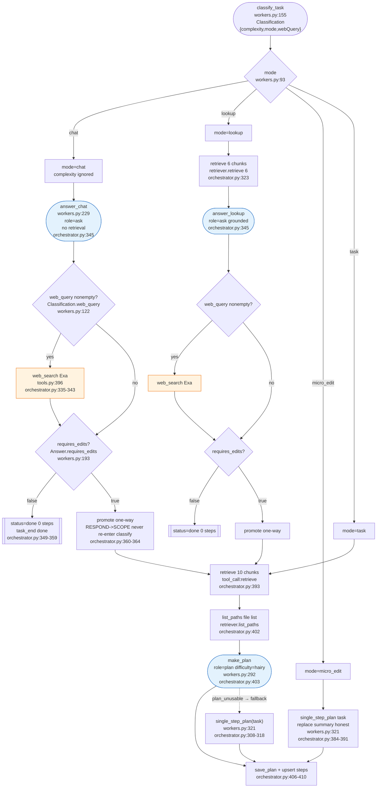

**Key invariants**

* `mode` defaults to `task` — false-negative costs one `make_plan`, false `chat` silently drops an edit (`workers.py:109-114`).
* `web_query` only for `chat/lookup`; `task/micro_edit` uses its own `web_search` tool later (`workers.py:115-122`).
* `requires_edits=true` is the **only** edge back into planning — `INTAKE not re-entered` (`orchestrator.py:362`).
* `from_micro_edit` flag changes REPLAN eligibility (`orchestrator.py:377-390`) — see §7.

---

## 3. Plan Lifecycle — build → normalise → store → resume

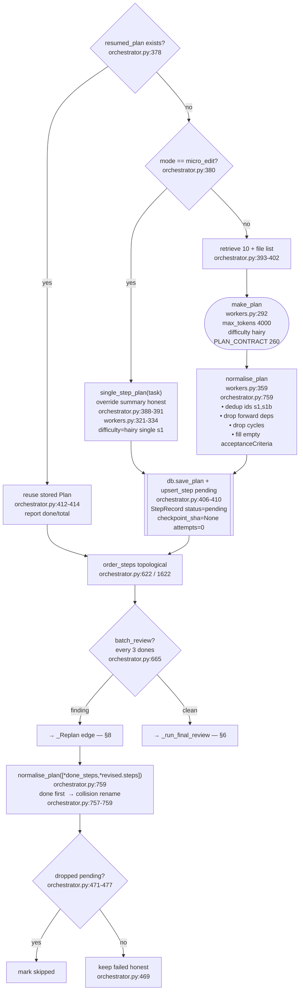

---

## 4. Step Scheduling — `_run_steps()` (`orchestrator.py:601`)

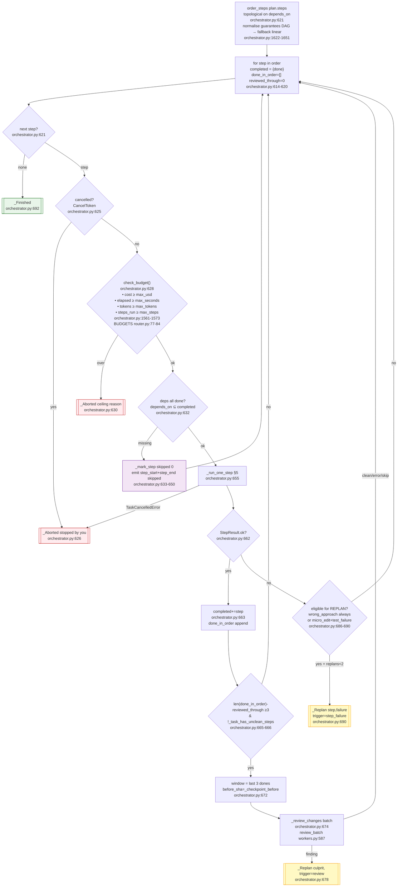

**Ordering guarantee** (`orchestrator.py:1622-1651`): `normalise_plan` keeps a dependency only if `position[d] < position[s]`, so `order_steps` is cycle-free by construction; fallback is declaration order, never deadlock.

---

## 5. Step Execution — `_run_one_step()` (`orchestrator.py:1057`)

Attempts = `task.budget.max_retries_per_step` (2 for easy/medium, 3 for hard — `router.py:77-84`). Every attempt is **non-identical** by construction.

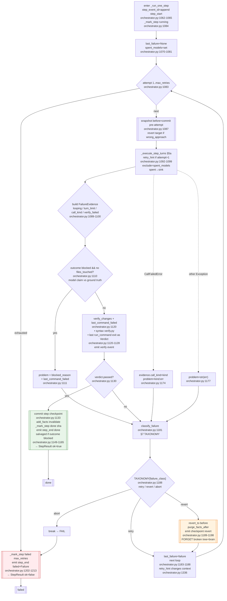

**Salvaged semantics** (`orchestrator.py:1136-1165`): `verdict.passed && outcome==blocked && files_touched` → `done` but `salvaged:true`, summary prefixed `"Did not finish cleanly … but what it had already written passes verification."` — `describe_outcome` later warns differently for salvaged completions (`orchestrator.py:1228-1239`).

---

### 5a. Turn Loop — `_execute_step_turns()` (`orchestrator.py:1374`)

`MAX_TURNS_PER_STEP=12` (`orchestrator.py:61`), `EXPLORE_BUDGET=4` (`orchestrator.py:70`). Fingerprints + explore budget are the stuck-detector.

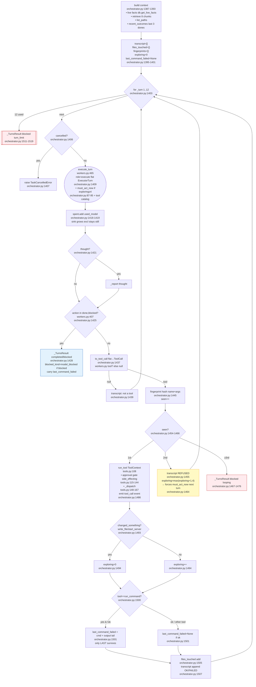

**`must_act_now` directive** (`orchestrator.py:87-95`):
> `"You have spent {n} turns looking without changing anything … Your next action MUST be write_file (or start_server or "done"/"blocked"). Do NOT call read_file/list_files/search_code/web_search again."`

**`write_file` immediate feedback** (`tools.py:237-290`): syntax check on write — if `previous_parsed && broken`, previous kept + `REJECTED`; else keep broken file for repair. Closes loop one turn earlier than waiting for `verify_changes`.

---

## 6. Review — L2 batch + final (`orchestrator.py:768-886`)

Shared `_review_changes()` from two call sites. Never a dependency — budget-gated, exception-swallowed.

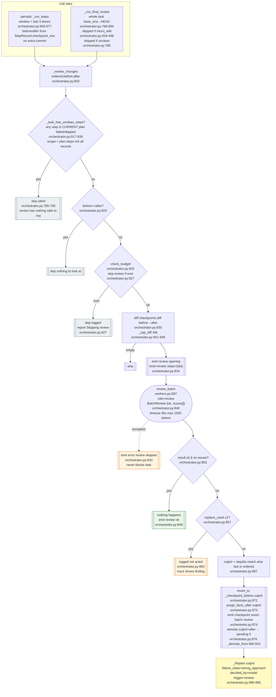

**Culprit localisation** (`orchestrator.py:867`): `issue.step_ids` guess or `ordered[-1]` — batch size 3 makes bisection not worth extra calls.  
**`_replan` story diverges by trigger** (`orchestrator.py:695-733`): `step_failure` → *"could not be completed after every retry"* vs `review` → *"passed its own checks but later review found … so its work was rolled back"*.

---

## 7. Recovery — `classify_failure()` + `TAXONOMY` (`orchestrator.py:954-1060`)

One label, then code chooses the response. Six of seven classes are decided without a model call.

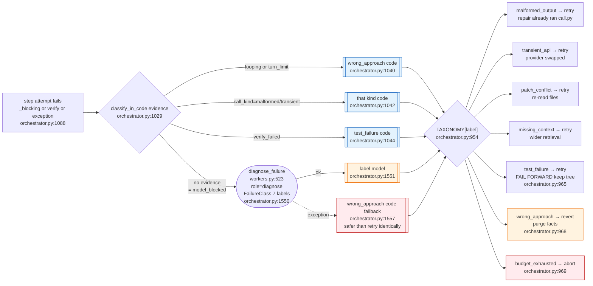

**Advice table** (`orchestrator.py:972-995`) — one human sentence per class, surfaced via `to_wire_failure()` into `step_end.failure.advice` (`shared/types.ts:52-66`).

| `failureClass` | `TAXONOMY` | `ADVICE` |
|---|---|---|
| `malformed_output` | retry | stronger model or smaller step |
| `transient_api` | retry | add second provider key |
| `patch_conflict` | retry | re-running usually works |
| `missing_context` | retry | pin relevant file with `@path` |
| `test_failure` | retry (forward) | kept so can be repaired — verify output says what broke |
| `wrong_approach` | **revert+purge** | re-phrase more concretely |
| `budget_exhausted` | **abort** | partial diff intact |

**No edge repeats identical action** (`orchestrator.py:1073-1081`): `retry_hint(attempt,failure)` changes context, `spent_models` excludes the failing model from router where possible — `call_model` drops `exclude` rather than starve (`orchestrator.py:1096-1099`).

### REPLAN eligibility — which failure earns a new decomposition

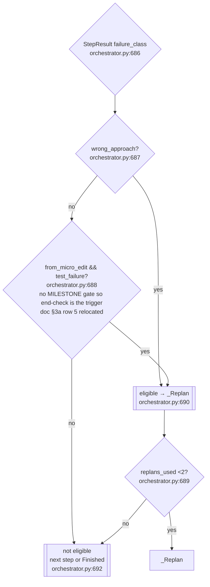

Resumed `micro_edit` ⇒ `from_micro_edit=false` (`orchestrator.py:372-377`) so it falls back to `wrong_approach`-only eligibility.

---

## 8. Replan Internals — `_replan()` (`orchestrator.py:695`)

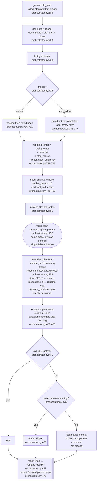

---

## 9. Budget & Cancel — the cooperative abort lattice

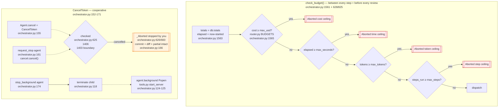

All ceilings sit **inside** the evaluation's hard limits (`$0.50/2700s → 0 score`, `orchestrator.py:21`, `router.py:64-71`) so an abort always returns a partial diff, never a halt-at-zero. `SECONDS_PER_USD = 16340` (`router.py:51`) is the pay-vs-wait exchange rate — see §12 routing.

---

## 10. Finalize — `Finalize` → `TaskOutcome` (`orchestrator.py:480-569`)

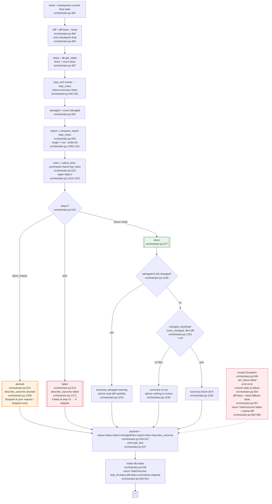

**`describe_outcome` branches** (`orchestrator.py:1217-1285`): never a model call — must not be able to fail.

| Final `status` | Guard | Summary | Advice |
|---|---|---|---|
| `done` salvaged | `salvaged>0 && changed` | *Finished all N but K did not complete cleanly — kept because it passes basic checks* | *Read diff carefully; re-run unfinished part alone* |
| `done` no-op | `!changed_anything` | *Completed all N without changing any files — already present* | *Nothing to review; say more specifically + pin @path* |
| `done` clean | else | *Done — all N completed* | — |
| `aborted` by user | `abort=="stopped by you"` | *Stopped at your request after D of T* | *Everything before stop still in diff — review or resume* |
| `aborted` ceiling | else | *Stopped early after D of T: reason* | *ditto if changed else nothing lost* |
| `failed` | else | *Failed at step sX (intent) after D of T; K skipped* | *Review diff then resume or re-phrase failing part* |

---

## 11. Tool Surface — approval gate (`tools.py:2-126`)

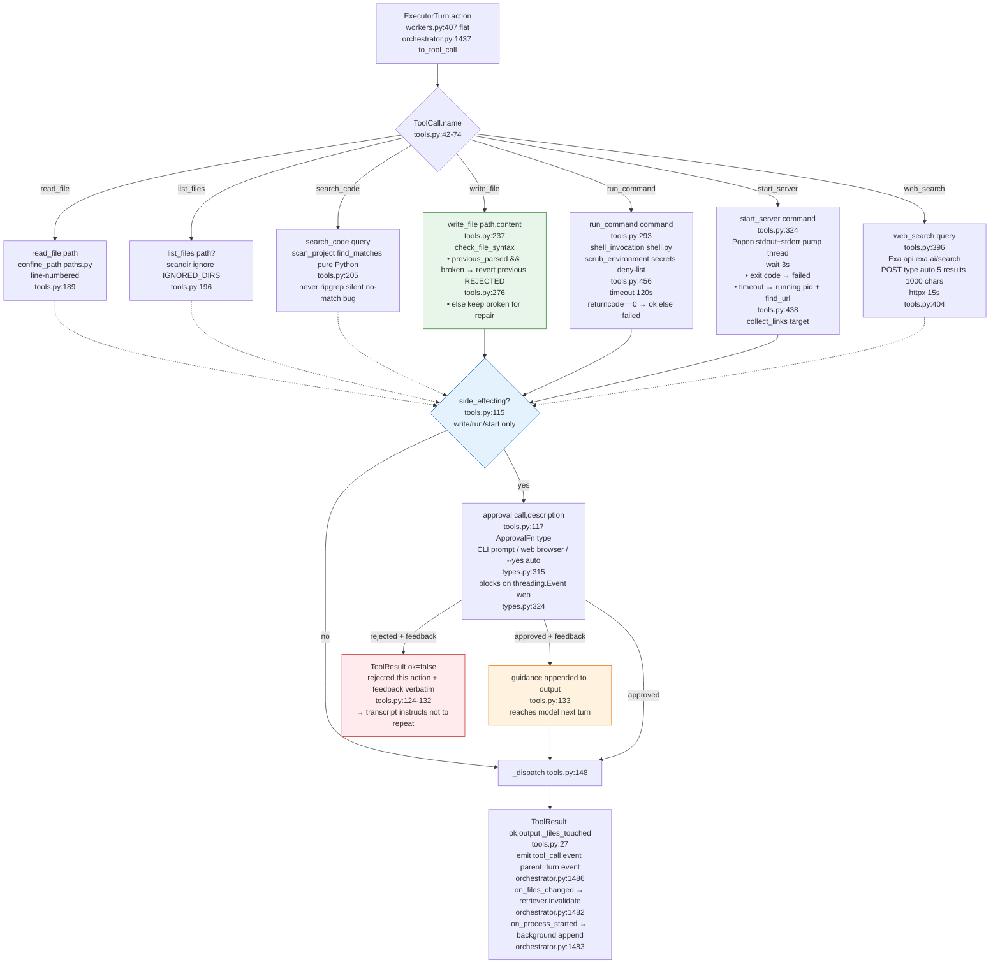

---

## 12. Routing — `Router.pick()` per call (`router.py:24-523`)

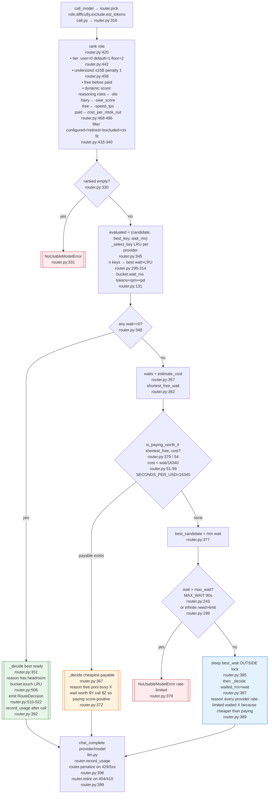

**Penalties**: `bucket.penalize retry_after_ms` (`router.py:156`), `bucket.record tokens` (`router.py:152`), `penalty_until` (`router.py:135`), headroom summed across keys for dashboard (`router.py:407`).

---

## 13. Resume — `run_task(resume_task_id)` (`orchestrator.py:231-253` + `601-614`)

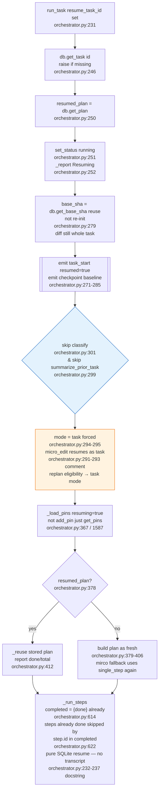

---

## 14. Agent Wiring — `create_agent()` (`orchestrator.py:103-159`)

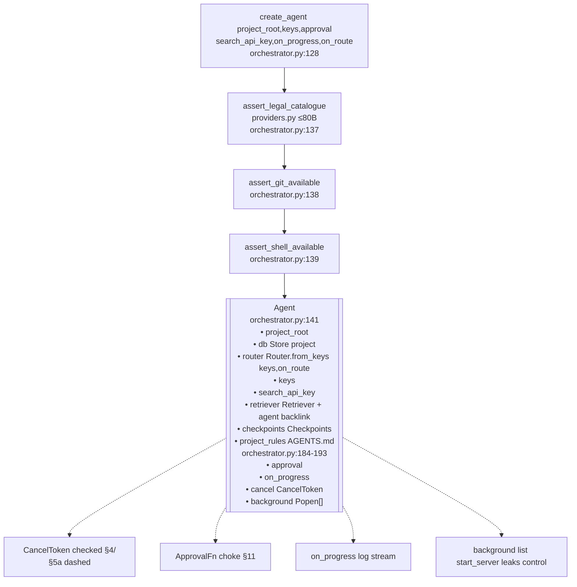

---

## 15. Event / Status Maps

### `TaskStatus` (`types.py:84`) — the wire `TaskSummary.status` (`shared/types.ts:16`)

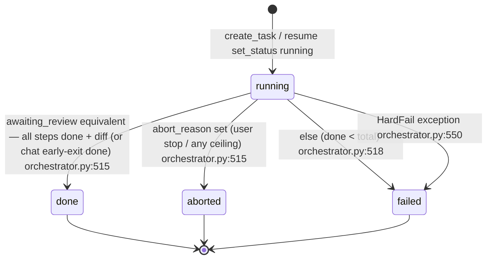

> `ARCHITECTURE-MAP.md §10` once claimed `done` unreachable — early-exit `chat/lookup` does set it (`orchestrator.py:349`).

### `StepStatus` (`types.py:147`) — per `PlanStep`

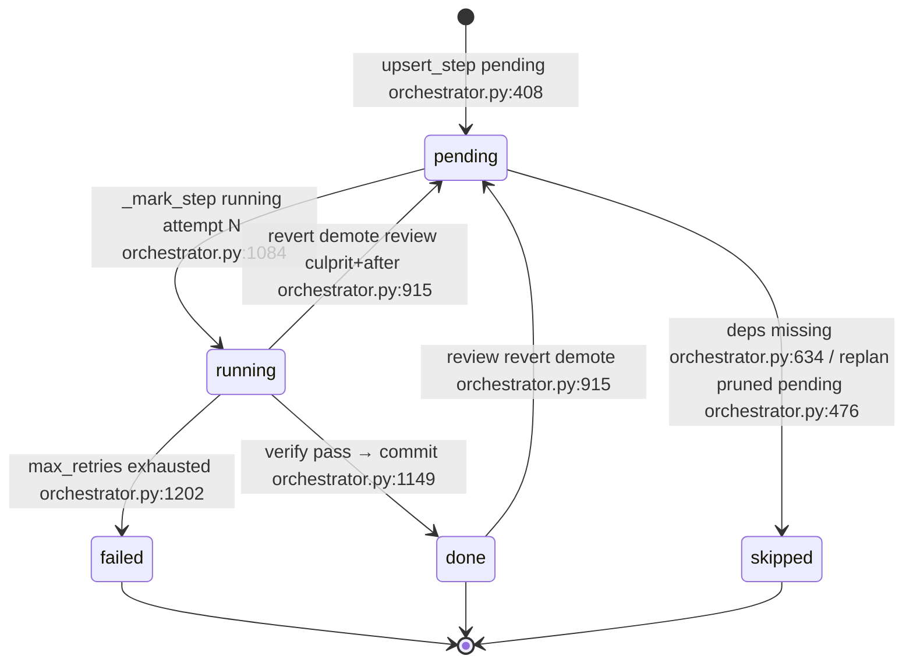

### `EventKind` emitted with `parent_id` tree (`types.py:223` / `shared/types.ts:162` / `orchestrator.py:544` event map)

| `kind` | `parent` | When | Source |
|---|---|---|---|
| `task_start` | root | create/resume | `orchestrator.py:271` |
| `checkpoint` baseline/final/revert/review | task or step | baseline, pre-attempt revert, review revert, final | `orchestrator.py:283/481/1195/874` |
| `tool_call` retrieve | task | lookup/plan/replan seeds | `orchestrator.py:323/393/745` |
| `tool_call` turn + `llm_call`/`route`/`assemble` | step/turn | per turn tool + per call routing | `orchestrator.py:1486` + `call.py` |
| `step_start` | task | before every step including to-be-skipped | `orchestrator.py:1062/640` |
| `verify` | step | syntax + last `run_command` verdict | `orchestrator.py:1125` |
| `review` open+verdict | task | batch / final | `orchestrator.py:834/849` |
| `step_end` | step | done/failed/skipped — carries `failure/wire`+`summary`+`salvaged`+`filesTouched` | `orchestrator.py:1150/1203/643` |
| `task_end` | task | done/aborted/failed — `report+links+summary+advice` | `orchestrator.py:537/350` |
| `error` | task/review | plan_unusable fallback, review call failure, hardFail | `orchestrator.py:310/843/551` |
| `compact` | call | window eviction (context.py) | `context.py` |

---

## 16. Constants at a glance

| Symbol | Value | Where |
|---|---|---|
| `MAX_TURNS_PER_STEP` | 12 | `orchestrator.py:61` |
| `EXPLORE_BUDGET` | 4 — then `must_act_now` | `orchestrator.py:70` |
| `MAX_REPLANS` | 2 | `orchestrator.py:73` |
| `BATCH_REVIEW_SIZE` | 3 | `orchestrator.py:79` |
| `REVIEW_DIFF_CHAR_CAP` | 40000 | `orchestrator.py:84` |
| `HARD_MAX_USD / SECONDS` | 0.50 / 2700 → score 0 | `router.py:47-48` |
| `MAX_WAIT_MS` | 90000 | `router.py:243` |
| `SECONDS_PER_USD` | 16340 = (0.65/0.15)/(0.35/1320) | `router.py:51` |
| `BUDGETS easy/medium/hard` | $0.03/0.06/0.10 · 600/1200/2000s · 150k/400k/800k tok · 8/16/28 steps · 2/2/3 retries | `router.py:77-84` |
| tool timeouts | `run_command 120s`, `start_server wait 3s`, `web_search 15s`, `classify 30s`, `diagnose 40s`, `review 45s` | `tools.py:315/365/413` `workers.py:170/540/598` |

---

## 17. How to read this with the code

1. Start at **§1 Master FSM** for the one picture.
2. Follow the `§` markers into the exact function — each node's caption is a cite (`file:line`).
3. Cross-check the three structural guarantees (`orchestrator.py:17-22`): no runaway spawning (one loop, no recursion), progress survives a dead call (state in SQLite), ceilings inside evaluation limits (partial diff, not zero).
4. For the `why` behind any shape (flat `ExecutorTurn`, `fail forward` on `test_failure`, `purge_facts_after` on revert, pay-vs-wait), see `ARCHITECTURE.md`; for the file map, see `ARCHITECTURE-MAP.md`.

---

*File generated as `docs/ORCHESTRATION-FSM.md` — render with any Mermaid-enabled Markdown viewer (GitHub, VS Code, `docsify`). All `stateDiagram-v2` + `flowchart` blocks are intentionally split: the `stateDiagram` is the auditable FSM; the `flowchart`s are the debuggable control-flow expansions. Together they are the whole orchestrator, with no hidden transition.*
