# Orchestrator Flow — as built

Companion to [`ARCHITECTURE.md`](ARCHITECTURE.md) (the reasoning) and
[`ARCHITECTURE-MAP.md`](ARCHITECTURE-MAP.md) (the ASCII-art system map). This
doc does one thing those don't: a diagram for every control path inside
[`agent/orchestrator.py`](../server/agentzero/agent/orchestrator.py), with a
line citation on every node so the picture and the source never drift apart
silently.

> **Not the same doc as `02a-orchestration-flow.md`.** That file describes an
> earlier, more elaborate FSM design — `BRIEF`, `MILESTONE` gates, a separate
> HITL broker, a Watchdog subscriber, a `Concierge` role with `debrief`, a
> `Diagnostician` role — none of which exist in the code below. It was
> actually **deleted from git in the same commit that rewrote this backend
> from TypeScript to Python** (`2a6c258`, `docs/02a-orchestration-flow.md |
> 825 --------`); it now survives only as an untracked file in the working
> tree. Everything in *this* doc was read out of the current source, the same
> standard `ARCHITECTURE-MAP.md` holds itself to.

All line numbers below are pinned to commit `2a6c258`, **except §1's `review`
row, §3's REVIEW step, and all of §7a**, which describe the L2 review pass
added afterward and cite the current working tree — re-pin these once that
work lands in a commit.

## Legend

| Shape | Means |
|---|---|
| `A["..."]` rectangle | deterministic code — no model call |
| `B(["..."]) ` rounded | a model call, schema-validated |
| `C{"..."}` diamond | branch on a mechanical predicate |
| `D[["..."]]` subroutine | durable write — git commit, SQLite row, event append |
| dashed edge | cooperative / cross-cutting signal (cancellation, not a normal transition) |

One invariant holds across every diagram here, stated once in the file's own
docstring: **control flow is never delegated to a model.** Models fill typed
slots (`Plan`, `Turn`, `FailureClass`); the loop, written in plain Python,
decides what happens next. See
[`orchestrator.py:1-23`](../server/agentzero/agent/orchestrator.py#L1-L23).

---

## 1. What code decides, what a model decides

```mermaid
flowchart LR
  subgraph CODE["Code decides"]
    A1["state after every call"]
    A2["retry / revert / replan / abort — TAXONOMY"]
    A3["what enters a call's window"]
    A4["when a step is stuck — fingerprint + turn cap"]
    A5["when the run stops — budgets"]
    A6["what gets committed"]
  end
  subgraph MODEL["Model fills one typed slot"]
    B1("classify_task → Classification")
    B2("make_plan → Plan")
    B3("execute_turn → one flat Turn")
    B4("diagnose_failure → FailureClass")
    B5("review_batch → BatchReview")
    B6("answer_chat / answer_lookup → Reply")
    B7("summarize_prior_task → prior-task digest")
  end
  CODE -->|"assembled window"| MODEL
  MODEL -->|"validated JSON"| CODE
```

Seven model jobs total, all in
[`workers.py`](../server/agentzero/agent/workers.py) and all imported at
[`orchestrator.py:50-53`](../server/agentzero/agent/orchestrator.py#L50-L53)
(`review_batch` current working tree, not yet at that pinned commit).
`normalise_plan` and `single_step_plan`, imported alongside them, are **not**
model calls — pure code that shapes or fabricates a `Plan`.

| Job | Called from | Frequency |
|---|---|---|
| `classify_task` | [`run_task` L277](../server/agentzero/agent/orchestrator.py#L277) | once per fresh task, skipped on resume |
| `answer_chat` / `answer_lookup` | [`run_task` L304-305](../server/agentzero/agent/orchestrator.py#L304-L305) | once, only for `chat`/`lookup` mode |
| `make_plan` | [`run_task` L361](../server/agentzero/agent/orchestrator.py#L361), [`_replan` L647](../server/agentzero/agent/orchestrator.py#L647) | once per plan, once per replan |
| `execute_turn` | [`_execute_step_turns` L1093](../server/agentzero/agent/orchestrator.py#L1093) | up to 12× per step attempt |
| `diagnose_failure` | [`classify_failure` L1221](../server/agentzero/agent/orchestrator.py#L1221) | only when the failure is genuinely ambiguous — see §7 |
| `review_batch` | [`_review_changes` L801](../server/agentzero/agent/orchestrator.py#L801) | every `BATCH_REVIEW_SIZE`(3) steps, and once at the end, skipped if the plan already has a failed/skipped step — see §7a |
| `summarize_prior_task` | [`run_task` L274-275](../server/agentzero/agent/orchestrator.py#L274-L275) | once, only on a follow-up prompt in the same conversation |

---

## 2. System context — orchestrator.py's neighbors

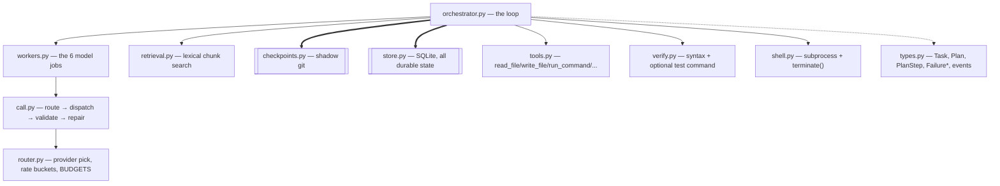

Import block: [`orchestrator.py:36-53`](../server/agentzero/agent/orchestrator.py#L36-L53).
Everything the loop needs is wired once into one `Agent` object — see §12.

---

## 3. Master flow — `run_task()`

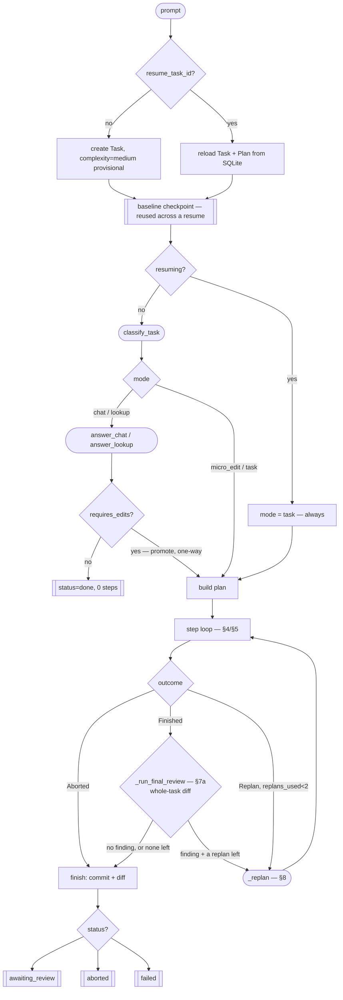

| Edge | Guard | Source |
|---|---|---|
| `resume_task_id? → reload` | plan/steps/facts/pins/baseSha all live in SQLite — nothing in a conversation | [L206-260](../server/agentzero/agent/orchestrator.py#L206-L260) |
| `classify_task` skipped on resume | already paid for; a resumed task is always mid-plan or mid-step | [L263-268](../server/agentzero/agent/orchestrator.py#L263-L268) |
| `RESPOND → PLANBUILD` | `Response.requires_edits = true`, **one-way** — never re-enters classify | [L318-322](../server/agentzero/agent/orchestrator.py#L318-L322) |
| `LOOP → REPLAN` | `wrong_approach`, or (`micro_edit` and repeated `test_failure`) — `replans_used < MAX_REPLANS(2)` | [L385-396](../server/agentzero/agent/orchestrator.py#L385-L396), [L68](../server/agentzero/agent/orchestrator.py#L68) |
| `Finished → REVIEW → REPLAN` | the L2 pass (§7a) runs whenever `_run_steps` finishes cleanly; only turns into a replan if it finds something AND `replans_used < MAX_REPLANS` — otherwise it falls straight through to `FIN` | current tree: [L390-403](../server/agentzero/agent/orchestrator.py#L390-L403) |
| any unhandled exception | still commits, still diffs, still returns a partial `TaskOutcome` | [L486-509](../server/agentzero/agent/orchestrator.py#L486-L509) |

---

## 3a. TRIAGE — the mode branch

`micro_edit` never gets a `Plan` object from `make_plan` — the single step is
synthesized directly, reusing `single_step_plan`'s shape but not its "planning
failed" summary (that summary is rendered verbatim into the executor's
context and would be a lie here).

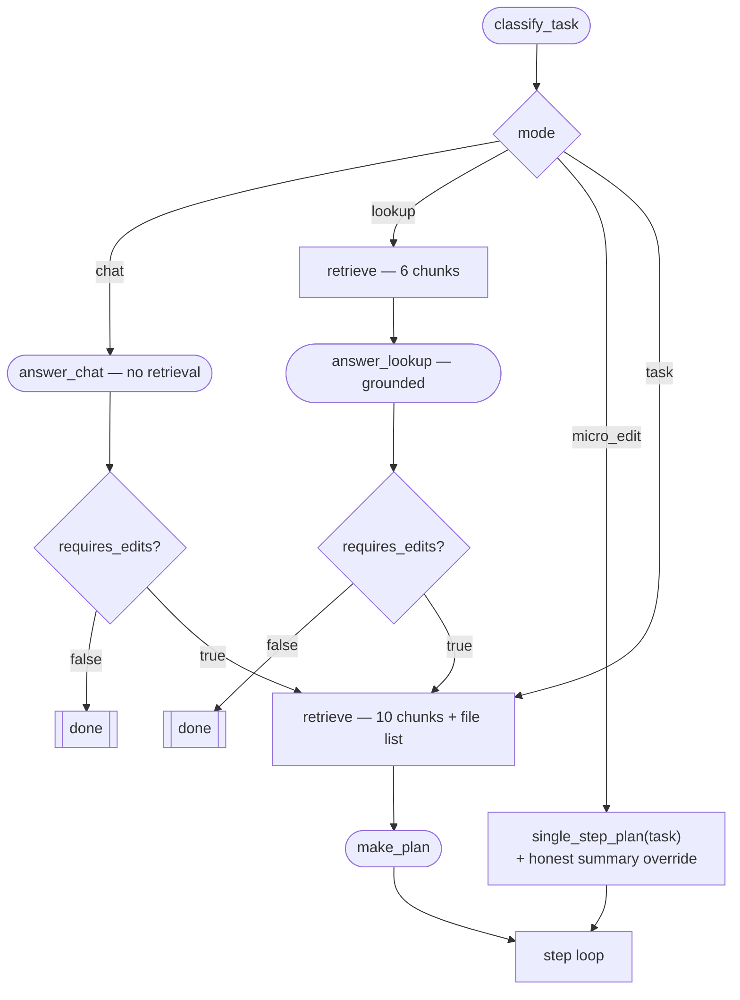

Source: [L290-367](../server/agentzero/agent/orchestrator.py#L290-L367).
`single_step_plan` override comment: [L338-348](../server/agentzero/agent/orchestrator.py#L338-L348).

---

## 4. Step scheduling — `_run_steps()`

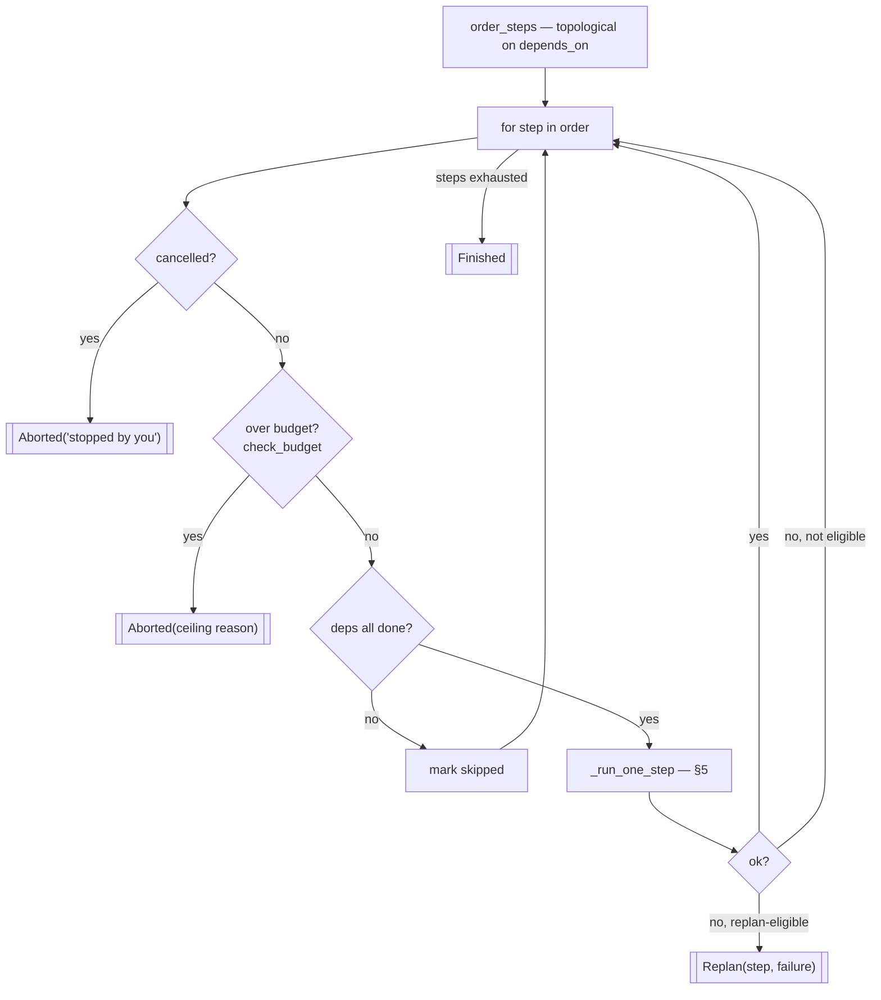

| Node | Source |
|---|---|
| `order_steps` — a cycle is unreachable by construction (`normalise_plan` only keeps strictly-backward deps), but degrades to declaration order rather than deadlocking if one ever appeared | [L1293-1322](../server/agentzero/agent/orchestrator.py#L1293-L1322) |
| `cancelled?` | [L555-556](../server/agentzero/agent/orchestrator.py#L555-L556) |
| `check_budget` — cost, wall-clock, tokens, steps, each ceiling deliberately inside the evaluation's hard limits | [L1232-1244](../server/agentzero/agent/orchestrator.py#L1232-L1244) |
| `deps all done?` | [L562-581](../server/agentzero/agent/orchestrator.py#L562-L581) |
| replan-eligible | `wrong_approach` always qualifies; `micro_edit` + `test_failure` qualifies because it has no milestone gate to catch drift early | [L596-605](../server/agentzero/agent/orchestrator.py#L596-L605) |

Not drawn above to keep this diagram readable: on the `H -->|yes| B` edge (a
step just succeeded), every 3rd completion (`BATCH_REVIEW_SIZE`) also runs
`_review_changes` (§7a) over that batch before looping back to `B` — a
finding there returns `Replan` exactly like node `Z3`, just from inside the
success path instead of the failure one. Suppressed entirely once any step in
the CURRENT plan is `failed` or `skipped` (§7a's `_task_has_unclean_steps`) —
node `H`'s `no` branch already means the diff or the plan is no longer clean,
and review has nothing safe to say about it. Current tree:
[`_run_steps` L624-641](../server/agentzero/agent/orchestrator.py#L624-L641).

---

## 5. STEP execution — `_run_one_step()`

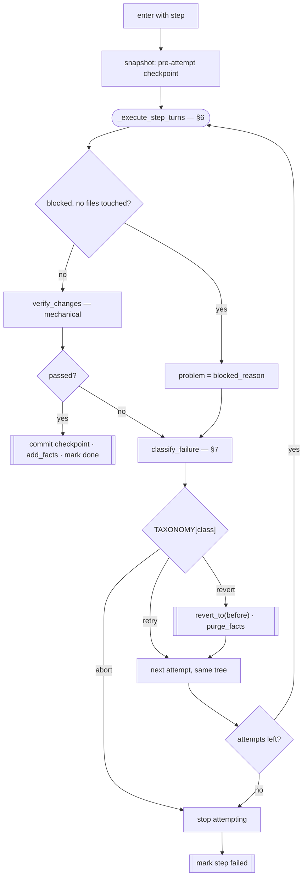

A step that verification passes but that the model itself gave up on mid-way
is marked **salvaged**, not clean — [L832-843](../server/agentzero/agent/orchestrator.py#L832-L843):
the model's own "blocked" claim is never trusted over mechanical verification
when files were actually touched, but it also isn't erased once the tree
passes.

Source: [`_run_one_step`, L763-910](../server/agentzero/agent/orchestrator.py#L763-L910).
`revert` also purges every fact learned while the tree was broken — "how
agents poison their own later steps," [L886-894](../server/agentzero/agent/orchestrator.py#L886-L894).

---

## 6. Turn loop — `_execute_step_turns()`

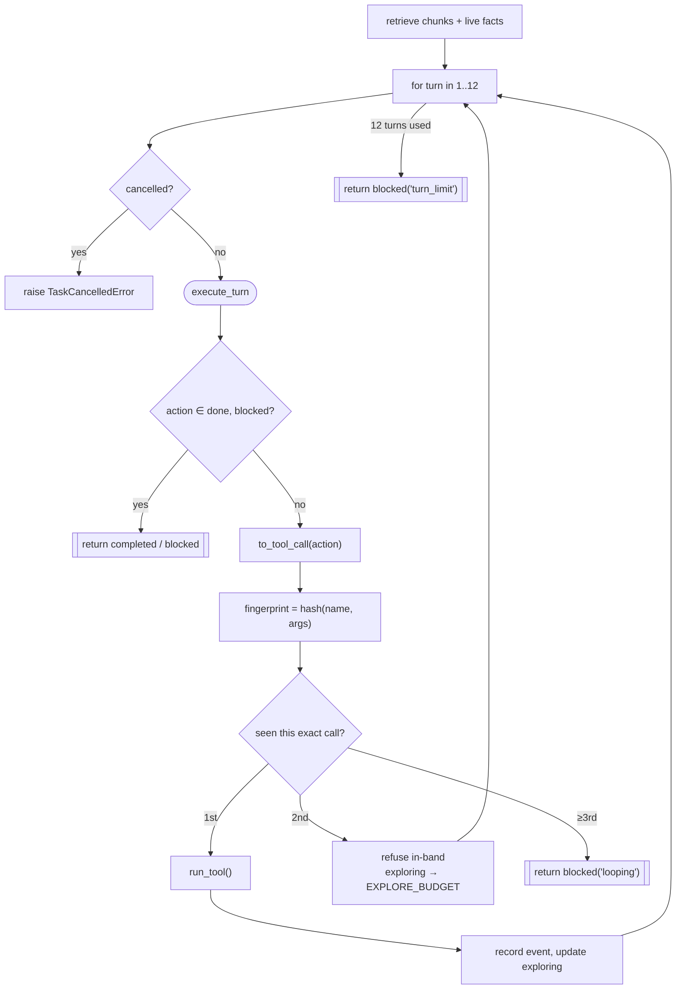

The stuck-detector fires on the **third** identical call, but the second one
already forces `exploring` up to `EXPLORE_BUDGET(4)` — most loops die there,
one turn before the hard cutoff. Source:
[L1061-1190](../server/agentzero/agent/orchestrator.py#L1061-L1190).
Constants: `MAX_TURNS_PER_STEP=12` [L56](../server/agentzero/agent/orchestrator.py#L56),
`EXPLORE_BUDGET=4` [L65](../server/agentzero/agent/orchestrator.py#L65).

---

## 7. RECOVER — `classify_failure()` and `TAXONOMY`

Detection is mechanical for six of seven classes. A model is asked only for
the executor's own unqualified "I am blocked" claim — the one case actually
open to interpretation.

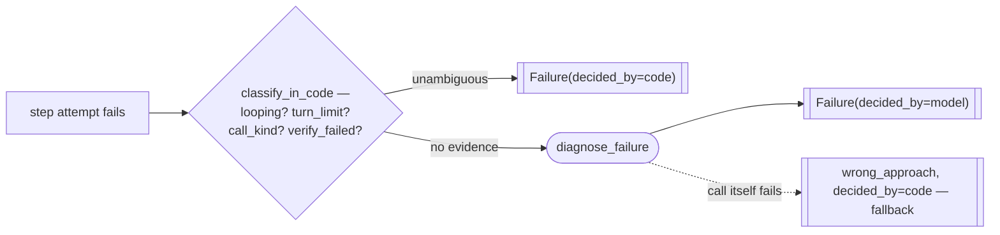

Measured on a real run: six `diagnose` calls once cost 148 of 275 seconds of
model time, and every one failed schema validation — the reason this is now
the exception, not the rule. [L1198-1229](../server/agentzero/agent/orchestrator.py#L1198-L1229).

| Failure class | Decided by | Response | Why | Source |
|---|---|---|---|---|
| `malformed_output` | code | retry | repaired already inside `call_model` | [L662](../server/agentzero/agent/orchestrator.py#L662) |
| `transient_api` | code | retry | provider swapped underneath, step untouched | [L663](../server/agentzero/agent/orchestrator.py#L663) |
| `patch_conflict` | code | retry | re-read the files and try again | [L664](../server/agentzero/agent/orchestrator.py#L664) |
| `missing_context` | code | retry | wider retrieval on the next attempt | [L665](../server/agentzero/agent/orchestrator.py#L665) |
| `test_failure` | code | retry | fail **forward** — the work mostly exists, keep the tree so the retry can read the failure and fix the line | [L666-671](../server/agentzero/agent/orchestrator.py#L666-L671) |
| `wrong_approach` | code or model | **revert** | the model was flailing — nothing to build on | [L672-674](../server/agentzero/agent/orchestrator.py#L672-L674) |
| `budget_exhausted` | code | **abort** | a ceiling was reached; whatever finished stays in the diff | [L675](../server/agentzero/agent/orchestrator.py#L675) |

**No row retries an identical action** — `retry_hint` always changes the
context the next attempt sees, and `call_model` drops any model that already
failed this step from the router's candidate set where possible. [L771-786](../server/agentzero/agent/orchestrator.py#L771-L786).

---

## 7a. REVIEW — L2, a pass over a batch's diff

Everything above this section judges one step against its own acceptance
criteria. Nothing in §4-§7 ever looks at the accumulated diff as a whole, so a
step can pass every mechanical check and still be wrong once the next step
builds on it — drift from the request, duplicated logic, a later change
quietly undoing an earlier guarantee. REVIEW is the layer that looks.

It fires from two call sites into one shared function: periodically inside
`_run_steps` (a window of the last `BATCH_REVIEW_SIZE`(3) completed steps),
and once more from `run_task` after the step loop finishes cleanly (the whole
task, `base_sha` → HEAD — see §3's `Finished → REVIEW` edge). Both go through
`_review_changes`, which never touches the tree on a clean verdict and, on a
finding, produces the same `_Replan` shape a step failure would.

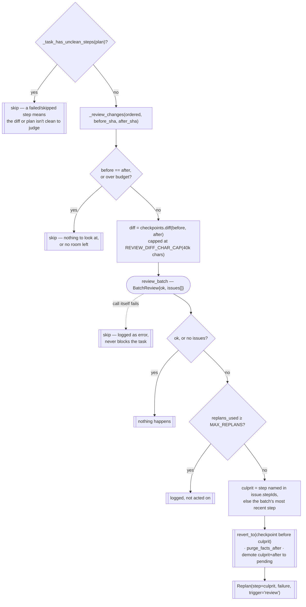

| Step | Detail | Source |
|---|---|---|
| two call sites, one function | periodic: `_run_steps`, window = last 3 done steps, `before_sha`/`after_sha` from the steps' own `checkpoint_sha` — no extra commit. Final: `_run_final_review`, `ordered` = every done step, `after_sha = checkpoints.head()` (safe because every attempt already commits, pass or fail) | [`_run_steps` L624-641](../server/agentzero/agent/orchestrator.py#L624-L641), [`_run_final_review` L729-757](../server/agentzero/agent/orchestrator.py#L729-L757) |
| never runs on an unclean plan, and stays off for the rest of the task once tripped | skipped (both call sites) if any step **in the current plan** is `failed` or `skipped` — checkpoints commit on every attempt regardless of outcome, so a diff spanning a failed step's fail-forward leftovers can't be attributed correctly, and a revert could roll back across a step that already has its own honest `failed` record. Scoped to the current plan, not every `StepRecord` ever written, so a step a REVIEW replan already superseded (and whose changes were already reverted) doesn't permanently disable later reviews | [`_task_has_unclean_steps` L879-900](../server/agentzero/agent/orchestrator.py#L879-L900) |
| the call | `review_batch` — `{ok, issues: [{description, stepIds}]}`; never asked what to do about a finding, same split as `diagnose_failure` (§7) | [`workers.py` `review_batch`](../server/agentzero/agent/workers.py) |
| localizing the culprit | the model's own `stepIds` guess, falling back to the reviewed span's most recent step — no bisection; at a batch size of 3 that's not worth the extra calls | [L817-828](../server/agentzero/agent/orchestrator.py#L817-L828) |
| acting on a finding | revert to the checkpoint immediately before the culprit (already exists — every step commits on success), purge facts, demote the culprit and everything after it in the reviewed span back to `pending` | [L831-839](../server/agentzero/agent/orchestrator.py#L831-L839), [`_checkpoint_before`](../server/agentzero/agent/orchestrator.py#L849-L858), [`_demote_from`](../server/agentzero/agent/orchestrator.py#L861-L876) |
| never a dependency | budget-gated before the call (`check_budget`), and any exception from the call is caught and logged rather than failing the task | [L786-789](../server/agentzero/agent/orchestrator.py#L786-L789), [L800-808](../server/agentzero/agent/orchestrator.py#L800-L808) |

`_replan` (§8) is told a **different story** depending on which edge fired:
a step-failure replan says the step "could not be completed after every
retry"; a review-triggered one says it "passed its own checks... but a later
review... found a problem" — conflating the two would tell the planner
something false about a step it can see already succeeded.
[`_replan`'s `trigger` param, L657-704](../server/agentzero/agent/orchestrator.py#L657-L704).

Source: current working tree (not yet at the `2a6c258` pin) —
[`_run_final_review` L729-757](../server/agentzero/agent/orchestrator.py#L729-L757),
[`_review_changes` L764-846](../server/agentzero/agent/orchestrator.py#L764-L846),
[`_task_has_unclean_steps` L879-900](../server/agentzero/agent/orchestrator.py#L879-L900).

---

## 8. REPLAN internals — `_replan()`

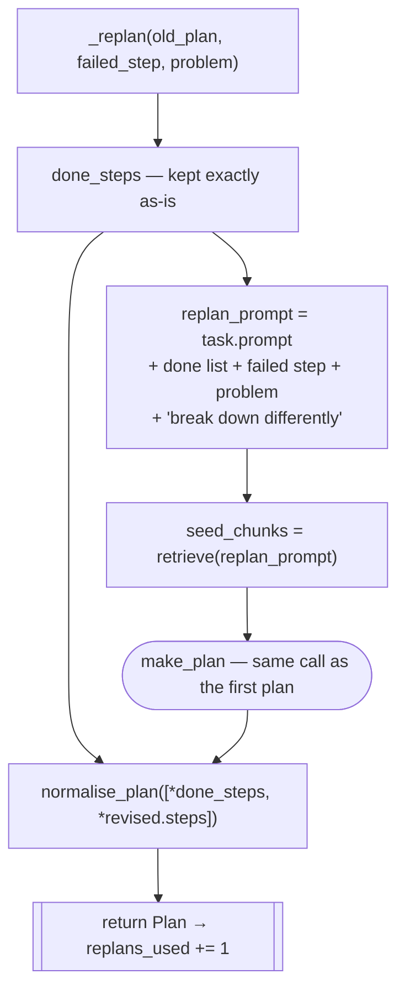

`done_steps` **first** in the merge: `normalise_plan` resolves id collisions
by input position, so a revised step that happens to reuse a done id gets
renamed instead of overwriting it, and every `depends_on` on a done step
stays validly backward. Source:
[L610-655](../server/agentzero/agent/orchestrator.py#L610-L655).

The failed step keeps its honest `failed` status — a differently shaped
replacement takes over the work, it doesn't erase the attempt. Only a step
the revision drops while still `pending` gets relabelled `skipped`:
[L406-417](../server/agentzero/agent/orchestrator.py#L406-L417).

---

## 9. RESUME

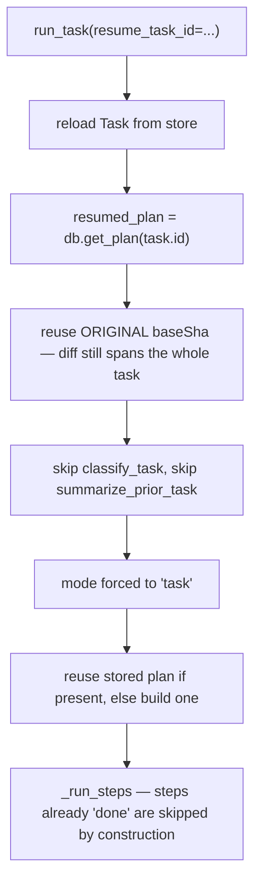

A resumed `micro_edit` step is real and resumable, but conservatively resumes
under the **task-mode** replan trigger, not the micro-edit one — the mode
distinction doesn't survive a restart. Source:
[L206-227](../server/agentzero/agent/orchestrator.py#L206-L227),
[L263-268](../server/agentzero/agent/orchestrator.py#L263-L268),
[L336-371](../server/agentzero/agent/orchestrator.py#L336-L371).
Resume needs no in-memory conversation to restore — the assembler always
reads fresh from SQLite (`ARCHITECTURE.md`, "Context: built fresh per call").

---

## 10. Budget ceilings — `check_budget()`

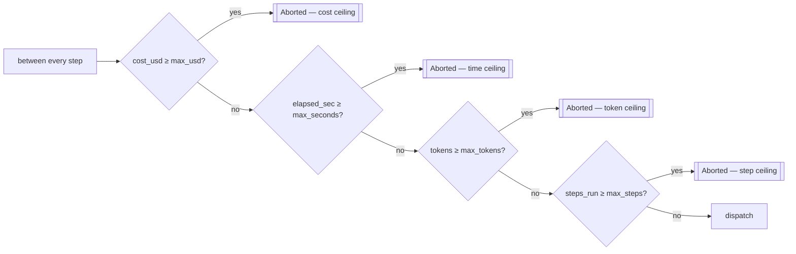

Four independent ceilings, one `BUDGETS[complexity]` row picked at classify
time (`easy`/`medium`/`hard`), all deliberately inside the evaluation's own
hard limits so the run always hands back a partial diff instead of being
halted at zero. Source: [L1232-1244](../server/agentzero/agent/orchestrator.py#L1232-L1244);
the `BUDGETS` table itself lives in [`router.py`](../server/agentzero/agent/router.py).

---

## 11. FINALIZE — reporting the outcome

The closing message is assembled entirely from state already on hand — never
a model call — because an explanation of a failure must not itself be able to
fail.

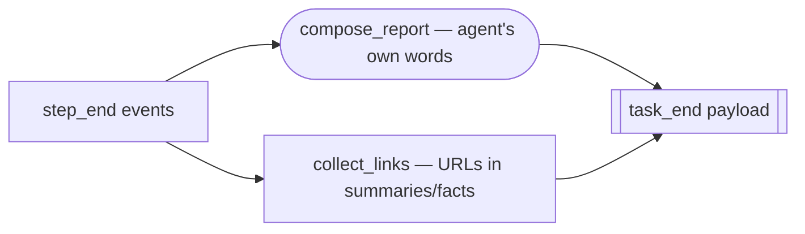

Source: `compose_report` [L994-1009](../server/agentzero/agent/orchestrator.py#L994-L1009),
`collect_links` [L1015-1021](../server/agentzero/agent/orchestrator.py#L1015-L1021),
payload assembly [L466-478](../server/agentzero/agent/orchestrator.py#L466-L478).

`describe_outcome()`'s five branches — [L913-983](../server/agentzero/agent/orchestrator.py#L913-L983):

| Status | Condition | What the user reads |
|---|---|---|
| `awaiting_review` · salvaged | done==total, ≥1 step only passed after being salvaged | "Finished all N steps, but K did not complete cleanly — read the diff carefully." |
| `awaiting_review` · no-op | done==total, nothing changed | "Completed all N steps without changing any files — nothing to review." |
| `awaiting_review` · clean | done==total, files changed, nothing salvaged | "Done — all N steps completed. Review the diff." |
| `aborted` | `abort_reason` set — a Stop or a ceiling | "Stopped at your request…" / "Stopped early: `<reason>`." |
| `failed` | else | "Failed at step X (intent) after N of M steps; K skipped." |

---

## 12. Agent setup & cooperative stop

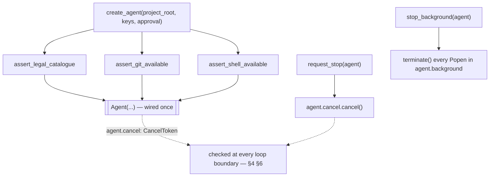

`request_stop` is cooperative, never a kill — a Stop that discarded the work
"would make people afraid to use it" (the function's own docstring).
`agent.background` is filled by `start_server` (§6's tool execution) and
drained by `stop_background`, called when a session closes so a dev server
doesn't leak past it. Source:
[L109-137](../server/agentzero/agent/orchestrator.py#L109-L137)
(preflight asserts [L118-120](../server/agentzero/agent/orchestrator.py#L118-L120)),
[L140-160](../server/agentzero/agent/orchestrator.py#L140-L160).

---

## 13. Pinning context — `_load_pins()`

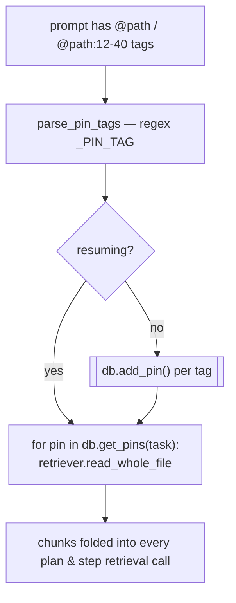

Pins are the one piece of user intent that bypasses retrieval's relevance
ranking entirely. Source:
[L1258-1290](../server/agentzero/agent/orchestrator.py#L1258-L1290).
Two smaller I/O helpers round out the file:
`read_project_rules()` [L163-172](../server/agentzero/agent/orchestrator.py#L163-L172)
(first of `AGENTS.md`/`agents.md`/`CLAUDE.md` found) and
`keys_from_env()` [L175-185](../server/agentzero/agent/orchestrator.py#L175-L185).

---

## 14. Event emission map

Every row is written before or as part of the write it describes, so replay
on resume is exact. `NewEvent.kind` values this file actually emits:

| Kind | When | Source |
|---|---|---|
| `task_start` | task created or resumed | [L246-249](../server/agentzero/agent/orchestrator.py#L246-L249) |
| `checkpoint` (baseline) | before classify | [L258-260](../server/agentzero/agent/orchestrator.py#L258-L260) |
| `tool_call` (`retrieve`) | lookup answer, plan seed, replan seed | [L299-303](../server/agentzero/agent/orchestrator.py#L299-L303), [L352-356](../server/agentzero/agent/orchestrator.py#L352-L356), [L641-645](../server/agentzero/agent/orchestrator.py#L641-L645) |
| `step_start` | a step is picked, including one that's about to be skipped | [L570-572](../server/agentzero/agent/orchestrator.py#L570-L572), [L767-769](../server/agentzero/agent/orchestrator.py#L767-L769) |
| `verify` | mechanical verification ran | [L821-824](../server/agentzero/agent/orchestrator.py#L821-L824) |
| `checkpoint` (revert) | `TAXONOMY[class] == revert` | [L891-894](../server/agentzero/agent/orchestrator.py#L891-L894) |
| `step_end` | step done, failed, or skipped | [L846-859](../server/agentzero/agent/orchestrator.py#L846-L859), [L899-909](../server/agentzero/agent/orchestrator.py#L899-L909), [L573-578](../server/agentzero/agent/orchestrator.py#L573-L578) |
| `tool_call` (turn-level) | every tool a turn actually runs | [L1167-1171](../server/agentzero/agent/orchestrator.py#L1167-L1171) |
| `review` (opening) | a batch or the whole task enters review — §7a | current tree: [L788-790](../server/agentzero/agent/orchestrator.py#L788-L790) |
| `review` (verdict) | `{ok, issues}` came back | current tree: [L803-806](../server/agentzero/agent/orchestrator.py#L803-L806) |
| `checkpoint` (review revert) | a finding was acted on — `payload.reason == "batch review"` | current tree: [L828-831](../server/agentzero/agent/orchestrator.py#L828-L831) |
| `checkpoint` (final) | finish | [L423-425](../server/agentzero/agent/orchestrator.py#L423-L425) |
| `task_end` | done (early-exit), or finish | [L308-311](../server/agentzero/agent/orchestrator.py#L308-L311), [L477-478](../server/agentzero/agent/orchestrator.py#L477-L478) |
| `error` | unhandled exception | [L491-493](../server/agentzero/agent/orchestrator.py#L491-L493) |

`payload["context_manifest"]`-equivalent detail (exact chunks retrieved) is
carried on the `tool_call` rows above — it's the one field that can't be
reconstructed after the fact, so it's written at call time or never.

---

## A correction worth flagging

While building this doc, `ARCHITECTURE-MAP.md` §10 turned out to have one
stale line: *"Task status `'done'` is typed in `TaskStatus` but NO code path
sets it… terminal states are `awaiting_review | failed | aborted`."* That's
no longer true — the chat/lookup early-exit path sets it directly:
[`db.set_status(task.id, "done")`, L307](../server/agentzero/agent/orchestrator.py#L307),
returning `TaskOutcome(status="done", ...)` at
[L313-317](../server/agentzero/agent/orchestrator.py#L313-L317). Both that
claim and this code were written in the same commit (`2a6c258`), so it reads
like an oversight in the doc rewrite rather than genuine drift — worth a
one-line fix in `ARCHITECTURE-MAP.md` whenever it's next touched.
