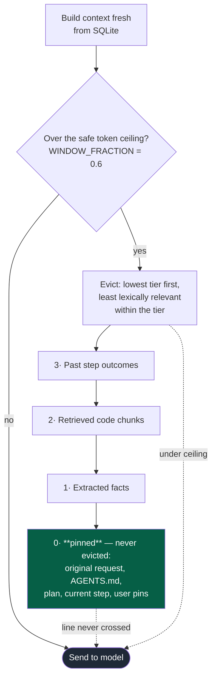

# Agentic IDE: Context Handling and Memory

A primary failure mode of agentic coding systems is "context collapse"—where a long-running task fills the AI's context window with a massive, rolling transcript of everything it has ever thought or done. As the window fills, small and medium models forget early instructions, hallucinate details, and eventually crash when the token limit is hit.

To solve this, our IDE completely abandons the concept of a rolling conversation transcript. Instead, context is strictly controlled, deeply durable, and aggressively managed.

---

## 1. No Rolling Transcripts: Durable Memory

There is no persistent conversational text log fed back into the model. Instead, every single time the orchestrator calls a model, the [context builder](../server/agentzero/agent/context.py) constructs the prompt completely fresh.

All state—the plan, the current step, live facts, retrieved code, and task outcomes—lives in a local SQLite database. This "stateless" context assembly provides massive benefits for **Long-Horizon, Multi-Session Tasks**:
- **Crash Resilience:** If a model call times out, the IDE is closed, or a rate limit halts execution, the task doesn't die. Because state lives on disk, the system simply re-reads the database and resumes exactly where it left off.
- **Zero Hallucination:** Because previous chat turns aren't stuffed into the context, the model cannot accidentally read its own past mistakes as truth.

---

## 2. Automatic Context Compaction

Even without a transcript, a long task can accumulate too many retrieved code chunks and facts. The system must autonomously compress the context to avoid crashing into the model's token limit.

When the built context approaches the safe token ceiling (a conservative fraction of the model's actual context window), the system triggers **Automatic Compaction**.

### The Compaction Strategy
Compaction does not rely on LLM summarization. Summarizing past events leads to the model "misremembering" crucial details later. Instead, the system uses a strict **Eviction Protocol**:

1. **Strict Priority Tiers:** The system categorizes information. If space is needed, it drops data in this exact order: 
   1. Past step outcomes
   2. Retrieved code chunks
   3. Extracted facts
2. **Relevance Scoring:** Within a tier, the system doesn't just drop the oldest item. It scores every block of text lexically against the current prompt, the step's intent, and the target files. The block with the *least* relevance to the current step is dropped first.
3. **Never Evicted:** Critical infrastructure is unconditionally pinned to the context and is never dropped. This includes: the user's original request, the project rules (`AGENTS.md`), the active plan, the current step instructions, and manual user pins.

If a block is dropped but becomes relevant again in a later step, the durable store simply pulls it back into the fresh context window for that step. Information is never lost or misremembered.

---

## 3. Manual Context Control

While the automated retrieval pipeline is highly effective, the developer always remains in control. The IDE provides robust manual context management.

- **Clickable Tagging:** The user can tag specific files or code blocks directly in the chat using the `@path` or `@path:line-range` syntax. Both the input box and output chat support these clickable tags.
- **Pinned Context:** When a user tags a file or block, the context handler categorizes it as a **User Pin**. User pins bypass all compaction logic and are permanently injected into the model's active context window until the user explicitly removes them. This guarantees the model is looking exactly where the user pointed it.

---

---

## 4. The `/bytheway` Command

During a complex, long-running task, a developer will often have a sudden, unrelated question (e.g., *"Wait, how do I install this specific package?"*). 

Normally, asking this in the middle of a task would inject irrelevant noise into the task's context, confusing the agent on its next step.

To handle this, the IDE includes the `/bytheway` command. When a user prefixes a message with `/bytheway`, the system executes a completely isolated, zero-context prompt. The agent answers the question purely on its own merits without seeing the massive, ongoing project context. Once the question is answered, the user is seamlessly returned to the original task, keeping the main context pristine and saving significant token costs.

---

## Summary

Dropping the rolling transcript for a DB-backed builder is what makes a task
survive a crash, and what stops the model reading its own earlier mistakes back
as fact. Eviction is lexical and tiered rather than summarised, so a dropped
block can be restored verbatim rather than recalled approximately.

**Trade-offs worth stating.** Lexical relevance scoring is cheap and has no
failure mode, but it is bag-of-words: a block that matters for reasons the
step's wording does not mention can be evicted, and only returns when a later
step names it. Rebuilding context from scratch on every call also re-sends
tokens a conversation-based agent would have cached — the cost of never
misremembering is paying for the same plan text more than once.
