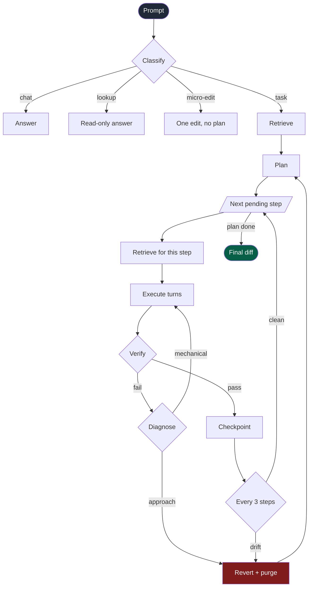
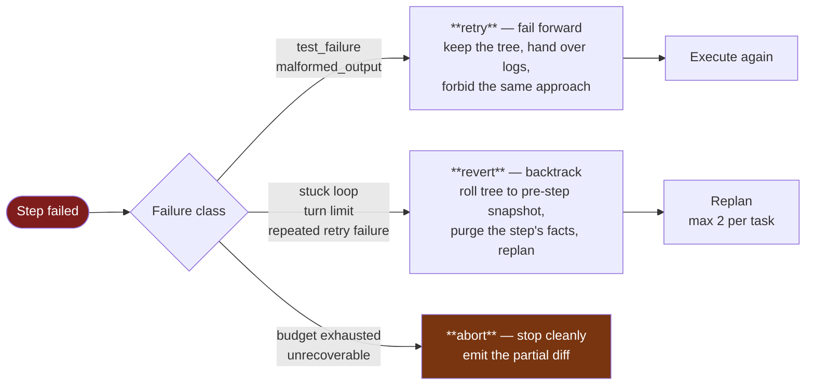

# Agentic IDE: Multi-Agent Orchestration Architecture

Complex coding tasks require multi-step reasoning, execution, verification, and recovery. Small and medium open-weight models (under 80B parameters) struggle to manage this autonomously in a single context window. To solve this, our orchestrator enforces a **deterministic loop** written entirely in code, rather than delegating control flow to a model. 

Models are used to fill specific roles (e.g., planning, coding, reviewing), but the orchestrator decides what happens next. This architecture handles failures, setbacks, and endless loops reliably, ensuring tasks progress from prompt to completion.

---

## 1. The Deterministic Loop

The entire task lifecycle runs synchronously through this structured pipeline:
`classify -> retrieve -> plan -> per step: [ retrieve, execute turns, verify, checkpoint | revert ] -> final diff -> human review`

Because the loop structure is hardcoded in
[`orchestrator.py`](../server/agentzero/agent/orchestrator.py), no model output
can add a stage, skip verification, or spawn another agent. There is no code
path by which the system recurses.

---

## 2. Triage Classification (The Front Door)

Before launching a full planning cycle, every prompt passes through a fast classification step (handled in [workers.py](../server/agentzero/agent/workers.py)) to determine its intent:
- **Chat:** A greeting or clarification (e.g., "hi", "thanks") that needs no file changes.
- **Lookup:** A read-only question about the codebase (e.g., "where is the auth logic?").
- **Micro-edit:** A trivial, single-file change (e.g., "fix this typo") that can bypass the planner entirely.
- **Task:** A complex, multi-file change that requires the full orchestrator loop.

This "triage" step saves significant time and API costs by preventing the system from over-engineering simple queries.

---

## 3. Breaking Down Tasks & Planning

When a task is classified as requiring code edits, it passes to the Planner agent. 
The planner breaks the large task into smaller, well-scoped sub-tasks. Each step receives an `intent` and `acceptance_criteria`.

- **Efficiency:** The steps are executed sequentially in strict dependency order. Parallel execution is deliberately avoided because it often causes merge conflicts and wastes free-tier API rate limits. 
- **Context Isolation:** When a step begins, it does not inherit the entire project's context. The retriever fetches exactly the code required for *that specific step* and nothing more. This keeps the prompt size small and avoids confusing the model with irrelevant files.

---

## 4. Execution and the stuck-detector (Failsafes)

During a step, the executor agent is allowed to interact with the project (read files, write files, run tests). However, small models can easily get stuck. 

The orchestrator enforces strict boundaries to prevent runaway execution:
- **Explore Budget:** If an agent spends `4` consecutive turns looking around (reading files, searching) without making an actual change, the orchestrator forcefully intervenes and demands a file edit.
- **Turn Limit:** Any single step is allowed a maximum of `12` turns. If it fails to complete the step within this limit, the step is aborted.
- **Loop Detection:** If the agent repeats the exact same tool call identically three times in a row, the stuck-detector fires immediately, recognizing that the model has stopped making progress.

Additionally, the task runs under a strict time and cost budget ceiling, aborting gracefully with a partial diff rather than hard-crashing if limits are hit.

---

## 5. Verification and Diagnosis (L1)

Models often falsely claim they are "done" even when the code is broken. Our orchestrator does not trust the model's word.
When an agent claims a step is complete, the orchestrator runs **mechanical verification**:
1. It checks the files touched.
2. It evaluates the exit code of the last command run (e.g., tests or linters).

If verification fails, the orchestrator diagnoses the failure. To save time and API costs, unambiguous failures (like a red test suite or a looping pattern) are diagnosed directly in code. The model is only asked to diagnose ambiguous failures (like the model explicitly stating "I am blocked").

---

## 6. Backtracking, Reverting, and Replanning

When a step fails, the system does not blindly retry the same action over and over. It responds based on a hardcoded **Failure Taxonomy** (`TAXONOMY` in `orchestrator.py`), which maps each failure class to one of three responses:

- **Fail Forward (Retry):** If the failure was a mechanical error (e.g., `test_failure` or `malformed_output`), the agent is given the error logs, told not to repeat the previous approach, and asked to fix the code. The tree is NOT reverted, allowing the agent to read its own broken code and fix it.
- **Backtrack (Revert & Replan):** If the failure represents a flawed approach (e.g., the model got stuck in a loop, ran out of turns, or couldn't fix the tests after multiple retries), the orchestrator recognizes that retrying is futile. 
  - The system rolls back the file tree to the exact snapshot before the step started.
  - The agent's memory of the bad step is purged.
  - The system triggers a **Replan**. The planner is told *why* the step failed and is asked to break down the remaining work differently or try a new approach.

This ensures the orchestrator doesn't pile new errors on top of old ones. It allows up to `2` full replans per task.

---

## 7. L2 Batch Review (Avoiding Drift)

L1 verification ensures a single step works, but it cannot see the big picture. To prevent drift, duplicated logic, or a later step undoing an earlier guarantee, the system runs periodic **L2 Batch Reviews**.

After every 3 completed steps, and once at the very end of the task, a review agent evaluates the combined diff. If it finds a problem:
1. It traces the problem to the most likely culprit step.
2. The orchestrator rewinds the project state to before that step occurred.
3. The steps following it are demoted back to "pending", and a Replan is triggered.

---

*Each model and tool call nests under the step that caused it. The `error → route`
pairs are providers failing and the router moving on without losing the step.*

---

## 8. Persistence and Resuming

A complex task might span longer than a single session. What if the user closes the IDE or a crash happens?
Because state is never stored inside an LLM's conversation history, progress is never lost. The orchestrator saves every plan, step status, and git checkpoint incrementally into a local SQLite store. 

If interrupted, the task can be fully resumed exactly where it left off, picking up the next pending step in the plan.

---

## Summary

Small models are managed rather than trusted: the loop decomposes the task,
hands each step only its own context, verifies mechanically before accepting a
"done", and distinguishes a failure worth retrying from one worth undoing.

**Trade-offs worth stating.** Steps run strictly sequentially. Parallel execution
would cut wall-clock time on independent steps, and was rejected because
concurrent edits to one tree produce conflicts the agent then has to reason
about, and because parallel calls burn free-tier rate limits several times
faster — the router's headroom logic assumes one in-flight call per task. The
budgets (12 turns, 4 explore, 2 replans, review every 3 steps) are tuned
constants, not derived ones; they are the numbers that stopped runaway tasks in
practice, and they live at the top of `orchestrator.py` to be adjusted.
