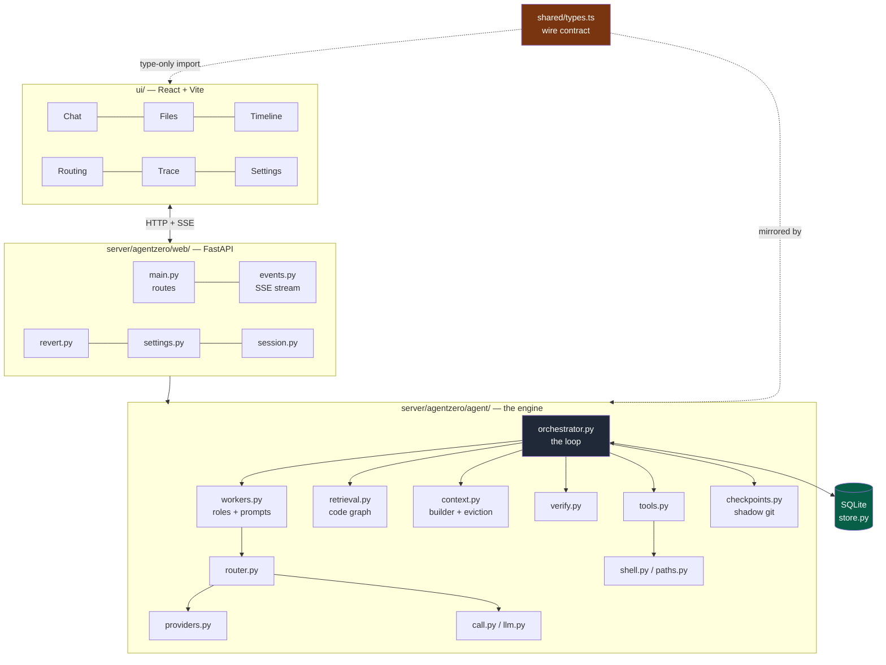

# Agentic IDE: Project Structure & Architecture Map

This document serves as a high-level map of the codebase, explaining how the different modules and directories fit together to form the Agentic IDE.

The project is broadly split into two halves: a robust Python backend (`server/agentzero`) that handles orchestration, reasoning, and file interactions, and a reactive TypeScript/React frontend (`ui/`) that serves as the developer interface.

---

## 1. Backend (`server/agentzero`)

The Python backend is the brain of the IDE. It is divided into two primary sub-modules: the core `agent` engine and the `web` server that exposes it.

### Core Engine (`server/agentzero/agent/`)
This directory contains the core orchestration loop, retrieval pipeline, and LLM interaction logic.

- **`orchestrator.py`**: The heart of the system. Implements the deterministic state machine that manages task lifecycle, step execution, and failure recovery.
- **`router.py`**: The dynamic model routing engine. Handles multi-key rate limiting (via LRU rotation), cost-vs-time calculations, and provider fallback logic.
- **`retrieval.py`**: The codebase indexing and search pipeline. Implements the LocAgent-style code graph to pull precise code chunks based on execution flow, avoiding vector-embedding noise.
- **`workers.py`**: Defines the specific roles and prompts for different agents (e.g., Planner, Diagnoser, Executor, Reviewer).
- **`context.py`**: The durable memory builder. Assembles strict, DB-backed context windows for the model and handles automatic context compaction and eviction.
- **`verify.py`**: Mechanical verification layer. Runs pure syntax checks (e.g., `python -m py_compile`, `node --check`) without making model calls.
- **`tools.py`**: Defines the tools the executor agent can use (read files, write code, run terminal commands, search the web via Exa).
- **`checkpoints.py`**: Manages the hidden shadow Git repository used to snapshot state for safe backtracking and manual reverting.
- **`store.py`**: The SQLite database operations layer. Persists all plans, steps, facts, and task outcomes to disk.
- **`parse.py`**: A resilient JSON parser designed to extract the correct payload even if the model hallucinates `<thought>` preambles.
- **`call.py` / `llm.py`**: Low-level interfaces for executing HTTP calls to LLM providers.
- **`shell.py` / `paths.py`**: Secure terminal execution and path confinement (preventing the agent from modifying files outside the project root).
- **`providers.py`**: The catalogue of supported models, enforcing the strict $\le$ 80B parameter limit.

### Web API (`server/agentzero/web/`)
The FastAPI application that bridges the core engine to the React frontend.

- **`main.py`**: The API entry point, declaring routes for task creation, status polling, and environment setup.
- **`events.py`**: Manages Server-Sent Events (SSE) to stream live agent activity, tool calls, and routing decisions to the UI.
- **`revert.py`**: Handles post-hoc task rollback requests from the UI Timeline, purging broken facts and restoring files.
- **`settings.py`**: Manages the persistence of user-provided API keys and provider configurations.
- **`session.py`**: Ensures tasks run safely within their isolated workspace contexts.

---

## 2. Frontend (`ui/`)

The React application built with Vite. It provides a rich, transparent interface for collaborating with the autonomous agent.

### Core Application (`ui/src/`)
- **`main.tsx` / `App.tsx`**: Application initialization and main layout shell.
- **`state.ts`**: Global IDE state management.
- **`api.ts`**: Client-side functions for communicating with the FastAPI backend.
- **`activity.ts` / `diff.ts`**: Utilities for parsing the stream of agent events and rendering readable unified diffs.
- **`pins.ts`**: Logic for extracting and handling `@path` tags for manual context control.

### UI Panels (`ui/src/panels/`)
The interface is broken down into distinct, specialized panels:
- **`Chat.tsx`**: The primary input interface for the user to submit tasks, lookups, and `/bytheway` questions.
- **`Files.tsx`**: A project explorer to view the workspace tree and read files.
- **`Timeline.tsx`**: A chronological record of task steps, offering the ability to view past actions and trigger powerful "Revert" rollbacks.
- **`Routing.tsx`**: A transparency pane displaying live router decisions (e.g., rate limits, cost savings, and provider fallbacks).
- **`DiffLines.tsx`**: Live visualization of code changes as the agent edits files.
- **`Trace.tsx`**: A window into the agent's internal reasoning and `<thought>` processes.
- **`Settings.tsx`**: Configuration menu for users to securely supply their provider API keys.
- **`ProjectPicker.tsx`**: Workspace selection and initialization logic.

---

## 3. Shared & Infrastructure

- **`shared/types.ts`**: A crucial file that keeps the Python backend and TypeScript frontend synchronized. Defines the shape of events, status payloads, and task outcomes.
- **`scripts/`**: Developer utility scripts (e.g., `setup.mjs`, `dev.mjs`) used to bootstrap the environment and start the local servers.
- **`tests/`**: The `pytest` suite for the `agentzero` backend, validating orchestration logic, FSM transitions, and tool safety.
- **`agentzero/cli.py`**: An alternative command-line interface for running the agent without the web IDE.
