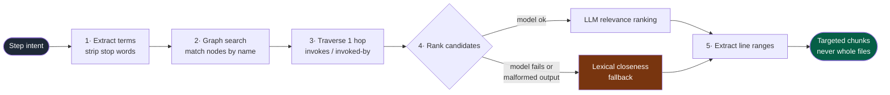

# Agentic IDE: Code Retrieval Pipeline

When a multi-agent system needs to modify a project, throwing the entire codebase into the prompt is not just expensive—it actively degrades the model's reasoning capabilities by flooding it with noise. 

Our retrieval architecture is designed to find precisely what the agent needs across multiple files, understand how those files interact, and return targeted code chunks without ever dumping whole files indiscriminately.

---

## 1. Project Isolation and Scanning

The foundation of the retrieval pipeline is a pure-Python, highly efficient project scanner. 
Unlike systems that shell out to external tools (which can fail and falsely tell the agent "no code found"), our scanner natively traverses the directory tree.

- **Strict Isolation:** The retriever is initialized exclusively with the absolute path to the user's current project root. Every codebase gets its own completely isolated index in memory. There is absolutely no risk of retrieval or agent memory leaking from one project into another.
- **Smart Filtering:** The scanner automatically ignores irrelevant build folders, cache directories, and binary files, ensuring the index remains lightweight and fast.

---

## 2. Going Beyond Vector Embeddings: The LocAgent Graph

Many coding assistants rely on simple keyword matching or plain vector embeddings (RAG) to find code. We explicitly rejected plain vector embeddings. Why? Because vector embeddings group code by semantic similarity (e.g., "authentication" near "login"), but they fail to understand the actual **execution flow and logic** of the code.

Instead, the IDE builds a lightweight, AST-like **Code Graph** (inspired by the LocAgent methodology). 
As the system scans the text files, it understands the code structurally. It builds a graph out of:
- **Nodes:** Directories, Files, Classes, and Functions.
- **Edges:** Relationships like `contains` (a file contains a class) and `invokes` (Function A calls Function B).

This means the index actually understands how the code works together. If the agent needs to modify a specific API endpoint, the graph inherently knows which helper functions that endpoint calls across multiple different files.

---

## 3. The Retrieval Execution Pipeline

When an agent needs context for a task (e.g., "Update the user profile validation logic"), the pipeline executes a multi-stage search strategy:

1. **Term Extraction:** The system parses the agent's intent, stripping out stop words and extracting high-value keywords.
2. **Graph Search:** The system looks up these keywords against the Code Graph to find the initial relevant entities (classes or functions).
3. **Graph Traversal (Expansion):** The system then traverses the graph, walking one hop outwards. It gathers the entities that *invoke* or *are invoked by* the initial matches. This is how the system effortlessly retrieves related logic scattered across multiple files.
4. **LLM-Powered Ranking:** Instead of dumping all the found code, the pipeline sends a lightweight, structured request to a fast reasoning model. The model's only job is to evaluate the issue against the list of candidate graph nodes and rank them by actual relevance.
5. **Precise Extraction:** Finally, the system pulls exactly the line ranges for the highly-ranked classes and functions. The agent receives clean, targeted code chunks, not overwhelming thousands of lines of code.

These steps are orchestrated by the [retrieval engine](../server/agentzero/agent/retrieval.py).

---

---

## 4. Graceful Degradation and Recovery

AI models and APIs can be unpredictable. What happens if the LLM-powered ranking step fails, times out, or produces malformed output?

A brittle system would crash or return an empty result, stalling the entire task. Our retrieval pipeline features a robust, graceful recovery mechanism. 

If the model fails to rank the candidates, the system instantly detects the failure and recovers by falling back to a **lexical closeness heuristic**. It scores the graph nodes internally based on how closely their structural names match the extracted search terms, sorts them, and returns the best matches.

The agent therefore always receives ranked context, even when the ranking model
is unavailable or returns malformed output.

---

## 5. Trade-offs Worth Stating

The graph is built by lightweight structural parsing, not a full AST per
language. It resolves `contains` reliably and `invokes` by name matching, which
means a call through a variable, a decorator, or dynamic dispatch is invisible
to it — the one-hop expansion catches the common case and misses the clever one.
It also indexes in memory and rebuilds per project open, which keeps isolation
absolute and start-up cost proportional to repository size.

Plain vector embeddings were rejected for the reason in §2, but the honest
comparison is that embeddings would find code that is *described* similarly to
the request, where the graph finds code that is *connected* to it. For "update
the validation on this endpoint", connectivity wins. For a vague request that
names no existing symbol, term extraction has less to grab, and the lexical
fallback is what carries it.
