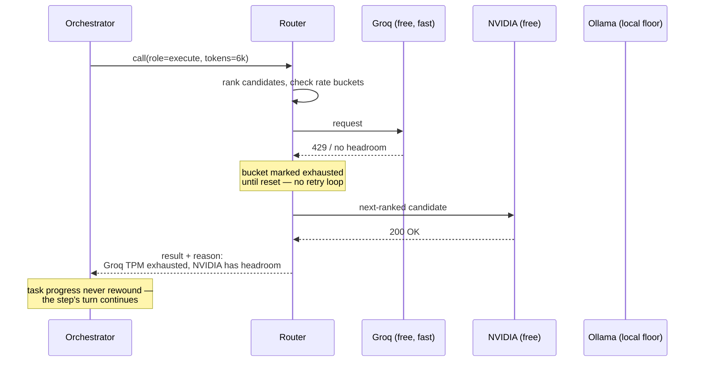
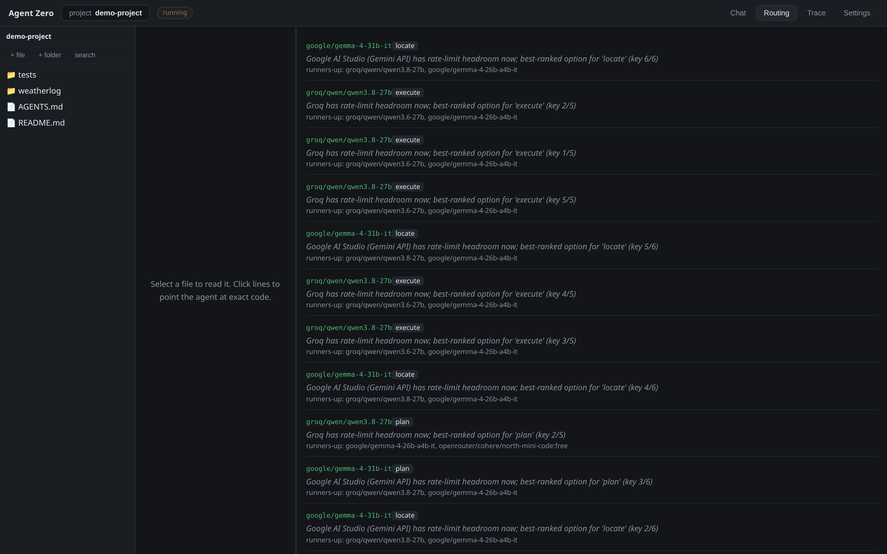

# Agentic IDE: Smart Routing Architecture

When orchestrating a multi-agent system powered entirely by small and medium open-weight models, a static model choice simply doesn't work. Different tasks require different capabilities, context windows vary wildly, and free-tier rate limits are quickly exhausted during long-horizon tasks. To maintain performance without crashing or silently burning money, the IDE relies on a dynamic, transparent, and highly optimized routing system.

This document explores how the routing architecture makes autonomous, intelligent decisions for every single prompt, ensuring that the right model is chosen for the right job, at the right time.

---

## 1. The Core Philosophy of Smart Routing

The system does not route blindly. For every prompt generated by an agent, the router evaluates all available models and providers, deciding the optimal destination based on real-time signals. 

This process evaluates four primary factors:
1. **Task Complexity:** Is the agent trying to plan a complex architecture, or just asking for a simple mechanical edit?
2. **Context Size:** How many tokens are required for this specific prompt? 
3. **Provider Rate Limits:** Has the provider's free tier been exhausted?
4. **Cost vs. Time:** Is it better to wait for a free rate limit to reset, or pay a fraction of a cent to continue immediately?

These decisions are calculated and executed in [the routing engine](../server/agentzero/agent/router.py).

---

## 2. Model Constraints and the Catalogue

Before any routing decision can be made, the system strictly enforces the hardware and cost limitations. The catalogue of available models, defined in the [providers configuration](../server/agentzero/agent/providers.py), acts as the source of truth for the router.

### Parameter Limits
Every model integrated into the system is strictly capped at a total parameter count of **80B or less**. This is rigorously enforced at startup; the system will refuse to run if a non-compliant model is detected. Each model entry cites its parameter count to ensure compliance.

### Tiered Preferences
The router categorizes providers into three preference tiers:
- **User Configured (`user`):** Providers where the developer has explicitly entered an API key in the settings menu. These are always prioritized.
- **Zero-Config Default (`default`):** A reliable, high-availability fallback (such as NVIDIA NIM) that ensures the system works out of the box even if no keys are provided. It steps aside gracefully once user keys are added.
- **Local Fallback (`floor`):** A safety net utilizing local hardware (via Ollama). This tier is designed to run comfortably on a device with 16GB RAM and 8GB VRAM. It operates as the absolute last resort when remote services are unavailable, ensuring no task ever gets permanently stuck due to network issues.

---

## 3. Dynamic Ranking: Matching Complexity to the Right Model

When an agent needs to execute a task, the router first generates a ranked list of capable candidates. The ranking algorithm ensures that simple tasks are sent to smaller, faster, or cheaper models, while difficult tasks are escalated to the most capable models available.

The ranking order evaluates the following:

1. **User Preference:** As mentioned, `user` tiers beat `default`, which beats `floor`.
2. **Size Floors:** A model over 15B parameters will always be prioritized over smaller models within the same preference tier. This ensures that when capable models are available, they are used, but small models remain ready if they are the only ones that can handle a specific role.
3. **Cost (Free vs. Paid):** Free models are prioritized before paid ones.
4. **Dynamic Task-Specific Scoring:** The tie-breaker depends entirely on the *role* of the agent and the *difficulty* of the task:
   - **Reasoning Roles (Planning, Diagnosing, Reviewing):** These tasks require logic over sheer coding output. The router ranks candidates based on their *Elo rating*.
   - **Hairy/Complex Execution:** If the task involves difficult, multi-step coding, candidates are ranked based on their *SWE-bench score*, ensuring the absolute best coding logic is deployed.
   - **Free Routine Tasks:** For simple mechanical edits where cost is zero, speed is the only metric that matters. Candidates are ranked by their measured *Tokens Per Second (TPS)*.
   - **Paid Routine Tasks:** When paying for mechanical edits, the router acts strictly to minimize spend, picking the candidate with the lowest cost per output token.

---

## 4. Rate Limiting and Graceful Fallback

In a multi-agent system, rate limits are hit frequently. The router is designed to handle these gracefully without losing task progress, looping endlessly, or crashing.

The system uses intelligent [rate buckets](../server/agentzero/agent/router.py) to predict whether a call will fit a provider's limits *before* making the call and triggering a `429 Too Many Requests` error. It tracks requests per minute, tokens per minute, requests per day, and tokens per day.

### The Fallback Process
If the top-ranked model is currently rate-limited, the router doesn't just fail. It smoothly evaluates the next best candidate. For instance, Groq provides incredibly fast models, but its token-per-minute ceiling is low. When Groq hits its limit, the router seamlessly hands off the workload to another provider (like NVIDIA or a local model) without skipping a beat.

If a model is completely retired (e.g., returns a 404 or 410 error), the system instantly removes it from the active session's roster. The model is dropped from all future rankings, preventing the system from repeatedly trying to access a dead endpoint and wasting time.

---

## 5. The Pay-vs-Wait Formula: Time vs. Cost

What happens when *every* free option is rate-limited? Should the system pause the task, or should it use a paid, pay-as-you-go API?

The router makes this decision mathematically, using a calculated exchange rate between time and money. Based on the system's evaluation constraints, the router knows exactly how much a second of wall-clock time is worth compared to a fraction of a cent.

The rule states that **$1 of spend is roughly equivalent to 16,340 seconds of wall-clock time**. 

When all free models are busy, the router calculates the cost of using the cheapest paid overflow model. If the cost of the paid API is less than the value of the time spent waiting for the free tier to reset, the system will spend the money to keep the task moving. If paying is too expensive relative to a very short wait, the router will deliberately sleep the process until the free rate limit clears. 

This ensures that token costs are kept incredibly low while minimizing unnecessary execution time.

---

*Every decision names the model, the role it was chosen for, the reason, which key
of the provider's pool was used, and the runners-up it beat.*

---

## 6. Complete Transparency

A core pillar of this architecture is that **routing decisions are never hidden**. 

Every single time a model is chosen, the router attaches a clear, human-readable `reason` to the event log. The user interface exposes this live. Users can watch the task progress and see exactly:
- Which provider and model is handling the current step.
- Why it was chosen (e.g., "Provider has rate-limit headroom now; best-ranked option for 'execute'").
- If the system is waiting, exactly how long it is waiting and why.
- If the system fell back to a paid model, exactly how much time it saved by spending those fractions of a cent.

---

## 7. Configuration and Setup

The system demands flexibility from the developer. The IDE includes a mandatory settings screen where users can securely type in and store their own API keys for every supported provider. 

Because rate limits are tracked per provider, supplying multiple API keys across different providers (e.g., Groq, Mistral, Google AI Studio, OpenRouter) drastically increases the system's throughput. The router thrives on having a diverse pool of limits to juggle, bouncing between them to maintain maximum velocity and accuracy.

---

## Summary

The router replaces a static model choice with a per-prompt decision over role,
difficulty, context size, live rate-limit headroom, and a cost-vs-time exchange
rate derived from the scoring weights. Every decision carries the reason it was
made, and a rate limit or a dead endpoint costs a fallback rather than the task.

**Trade-offs worth stating.** Ranking is a hand-written comparator over static
catalogue metadata (Elo, SWE-bench, TPS, price) — not a learned policy. It is
deterministic, debuggable, and explains itself in one line, but it cannot adapt
to a model that is having a bad day; the metadata has to be updated by hand when
a provider changes its lineup. Rate-limit prediction is likewise optimistic: it
estimates output at `ASSUMED_OUTPUT_TOKENS` (800) before the call, so a run of
unusually long completions can still draw a `429`, which is handled as a normal
fallback rather than being prevented.
