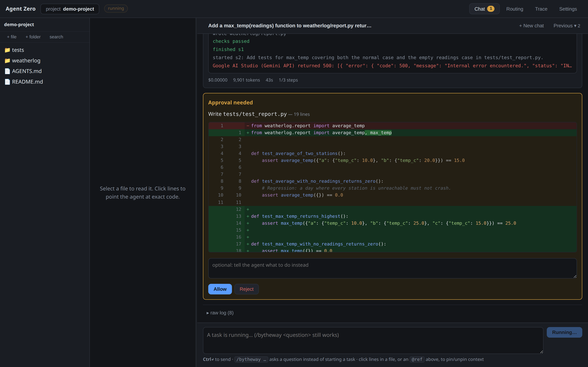
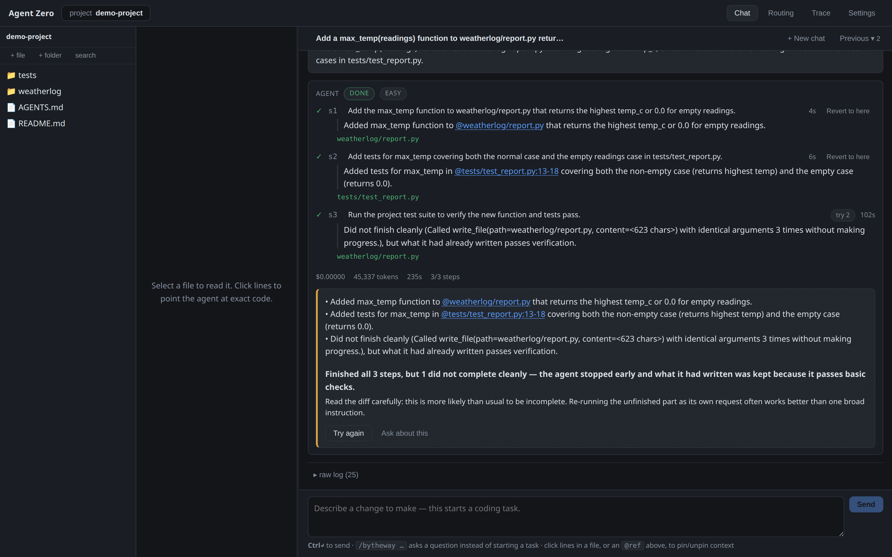

# Supporting Features

Orchestration, retrieval and context management are the core. These are the
features around them that decide what the agent can see, what it is allowed to
do, and how its work gets undone when it goes wrong.

---

## 1. Manual Context Control

Automated retrieval cannot read the developer's mind, so context is also
steerable by hand.

- **Clickable file and line tags.** Files and specific code blocks can be added
  to or removed from the active context at any time, with `@path`,
  `@path:12` and `@path:12-40`. Tags work in both the input box and the output
  chat — clicking a line in the file viewer inserts the tag, and clicking a tag
  in a reply opens that exact range. The parsing lives in
  [`pins.ts`](../ui/src/pins.ts) and `_PIN_TAG` in
  [`orchestrator.py`](../server/agentzero/agent/orchestrator.py).
- **Pins survive compaction.** A tagged block is stored at `pinned` priority,
  the tier the eviction pass never touches. See
  [Context Handling](context_handling.md#2-automatic-context-compaction) for the
  eviction order.
- **`/bytheway`.** Asks one isolated question with zero task context and
  returns to the task untouched — useful mid-task ("what does this regex do?")
  without polluting the step's prompt or paying for the full context.

---

## 2. Tools and Approval Gates

The executor has a small, fixed catalogue defined in
[`tools.py`](../server/agentzero/agent/tools.py):

| Tool | Side-effecting | Notes |
|---|---|---|
| `read_file` | no | |
| `list_files` | no | |
| `search_code` | no | |
| `web_search` | no | via [Exa](https://exa.ai); degrades to "not configured" without `EXA_API_KEY` |
| `write_file` | **yes** | syntax-checked immediately after the write |
| `run_command` | **yes** | the project's test suite, linters, and its *own* git (diff/log/status/branch/commit/merge) |
| `start_server` | **yes** | long-running processes, output pumped back to the agent |

**Git is reached through `run_command`, not through dedicated tools.** The agent
runs `git` against the project's own repository the same way a developer would.
This is deliberate: a `git_commit` tool would have to re-implement staging,
message conventions and conflict handling that `git` already does, and every
project's git workflow differs. The shadow repository used for checkpoints is
separate and is never exposed to the model.

**Every side-effecting tool call stops and waits for a human.** The approval
callback wraps each call in the orchestrator loop; the UI surfaces it in the
Timeline with the exact command or file content to be written, and nothing runs
until it is approved. This is the safety boundary — the agent has real terminal
access, and the gate is what makes that acceptable.

**Tools are also the feedback loop.** After a `write_file`, mechanical
verification runs a pure syntax check (`python -m py_compile`, `node --check`)
with no model call; a failure goes straight back to the agent as an error to
fix. The agent uses `run_command` to run the project's tests and read the exit
code, which is the same signal the orchestrator's L1 verification uses to decide
whether a step may close.

*A side-effecting call stops here with the exact diff it wants to apply. The note
box redirects the agent in one turn — a bare reject tends to make it retry the
same thing.*

---

## 3. Diffs and Revert

Changes are backed by a hidden shadow git repository. Each completed step
commits a checkpoint, so the tree's state at every step boundary is
recoverable, and the diff between any two of them is a real `git diff` rather
than a reconstruction.

- **Live diffs.** Edits render as unified diffs as the agent makes them
  ([`DiffLines.tsx`](../ui/src/panels/DiffLines.tsx)), with the final task diff
  taken from the first checkpoint to the last.
- **Revert to a step.** The Timeline can roll the working tree back to exactly
  how it looked after any earlier completed step
  ([`revert.py`](../server/agentzero/web/revert.py)). Every step after the
  target returns to `pending` with its checkpoint and attempt count cleared.
- **Beliefs are purged with the code.** Facts the reverted steps recorded are
  dropped along with their commits. A fact about code that no longer exists is
  precisely how a later attempt gets poisoned, so revert follows the same rule
  the orchestrator's own backtracking does.
- **Nothing auto-retries after a revert.** Re-running the old plan's later steps
  unchanged would just reproduce whatever was being reverted away from. The
  user's next message decides what happens instead.

The approval gate in §2 is what stands between the agent and an unwanted
change: writes are accepted or rejected one at a time, as they are proposed,
rather than reviewed in a batch at the end.

---

*Every completed step carries a **Revert to here** link: the tree returns to that
step's checkpoint and everything after it goes back to pending.*

---

## 4. Project Memory (`AGENTS.md`)

Project-wide rules — "always use functional React components", "run `make
check` before claiming done", folder conventions — live in an `AGENTS.md` at the
project root.

- **Injected into every model call**, not just the first. There is no rolling
  transcript for a rule to scroll out of.
- **Never evicted.** `AGENTS.md` is classified alongside the user's original
  request and the active plan as a block compaction may not drop, so a stated
  preference is still in the window after any number of compaction events.

This repository ships its own [`AGENTS.md`](../AGENTS.md), which is both a
worked example and the rules the agent follows when working on itself.
